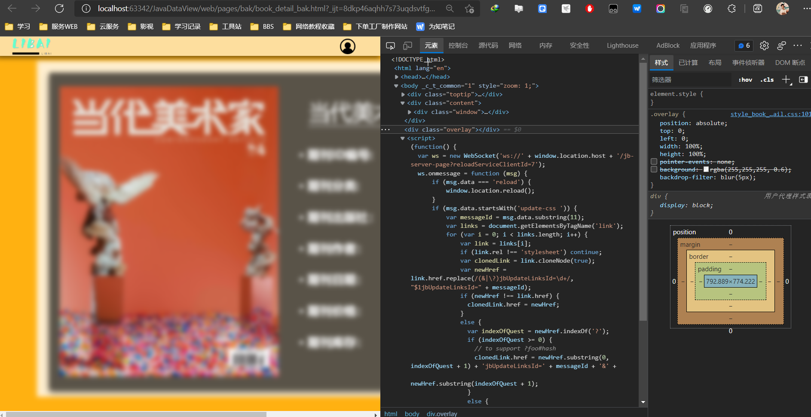
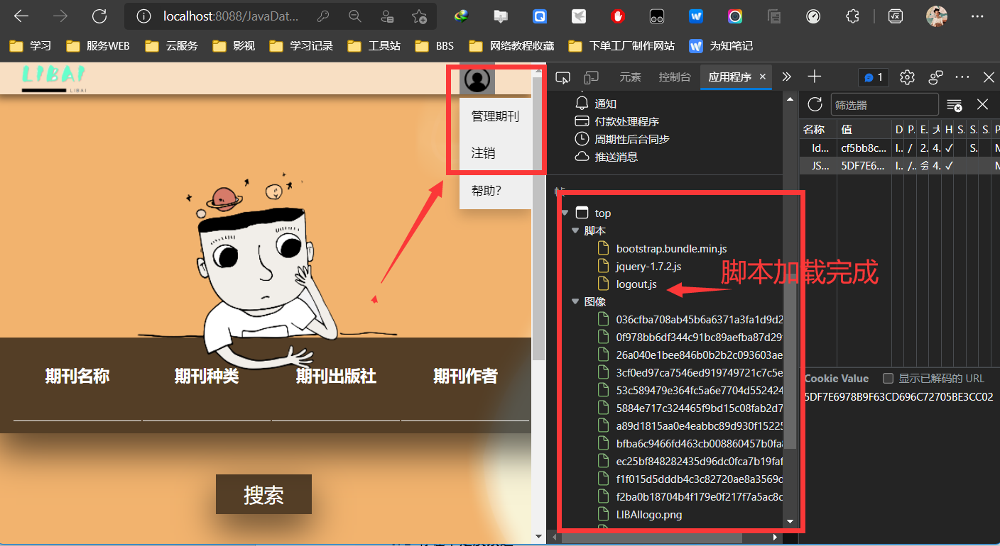

# 基于JavaWeb开发的期刊管理系统
# 一、课题简介  
## 1.1 背景及现状   
    伴随着国家近些年数字化产业的发展，人们对于数字化产品依赖程程度逐步增大。其次国家进一步推进精神文明建设，大量建设电子图书项目。另一方面如人们依赖于电子图书电子期刊阅读，但是仍有大量的喜爱纸质阅读的读者，那么如何管理自己海量的期刊信息成为了一个重要的问题。

## 1.2 设计内容与设计思路   
    此次期刊管理系统的设计主要包含以下三方面的内容。首先是用户权限管理，通过对于不同用户权限的管理，使得一般用户可以使用本系统进行期刊信息的查询，获取到自己需要的期刊信息，也可以使用模糊查询获取所需要的期刊详细信息。而对于管理员，则方便其进行系统的维护与管理以及进行期刊信息的修改，增删改查当前系统内部所存储的期刊版本以及属性。其次是期刊的检索功能，通过对于如今现有的互联网期刊系统网站进行分析可以发现，其基本上均具有期刊模糊匹配与精准匹配的功能，因此对于本系统的设计也将包含这两种检索方式，也就是通过使用期刊名称、编号、作者、出版社以及其他附加属性来进行检索信息。最后就是一个良好的可视化界面，通过不同色彩以及页面标注的简约的可视化界面，提升用户在搜索使用Web系统时的观感，方便用户进行使用。

## 1.3 设计目的及意义
    从用户体验的角度来看，通过简约化的设计方法以及快捷精简的页面，使得用户可以通过鼠标与页面的交互直观方便的获得自己所需要的期刊信息，并且对于期刊管理者来说，不仅满足了自身对于海量期刊信息管理的需求，也提升了在管理过程中的工作效率，使得其可以更好的维护期刊信息来满足用户的需求。从数字化的角度来看，一个成熟而方便的管理系统可以加快期刊的数字化进程，使得更多的优质期刊以及经典期刊可以获得更好的存储与阅读，有助于当前国家的数字图书计划的开展，也切合了当前人们碎片化时间阅读的习惯。

# 二、系统分析与设计
## 2.1 可行性分析   
### 2.1.1 经济可行性
  本期刊信息管理系统能为期刊管理者提供准确、及时的信息，对管理者的决策提供有利的支持；能够促进院校的体制改革，提高工作效率，减少手工工作人员及费用等，这些都是使用系统所带来的间接收益。同时也促进了学校信息化的进程，提高学院的管理效率。作为期刊信息管理这样的商业性质较小的系统，其经济成分比重相对较少，主要是支出的费用，其中包括设备购置费、软件开发费用、管理和维护费、人员工资和培训支出等。由于各个图书馆实行统一操作，系统共享，其设备购置，人员工资，维护费用相对较少，前期的资金授入主要集中于购置期刊上。建立信息中心，可将来自各方面的期刊集中管理，提高期刊管理的计划性和预见性，快速地反馈市场信息。
    鉴于计算机技术发展异常迅猛，在硬件软件配置以及开发技术均以可行的情况下开发这样一个管理系统成本不会很高，但其可以大大提高图书馆的工作效率，也是图书管理发展的必然趋势，其必将有比较宽阔的市场，因此改性统在经济可行性上时可行的。

### 2.1.2 技术可行性
    主要分析现有技术条件能否顺利完成开发工作、硬件、软件配置，能否满足开发者的需要，以及各类技术人员的数量、水平、来源等。期刊信息管理系统的工作主要是在读者和期刊管理之间架起一座桥梁，能相互沟通信息和处理信息。这一特点非常符合计算机特点，通过网络 internet 技术，发挥计算机的信息传输速度快、准确度高的优势。随着计算机技术的深入发展，相关的应用软件、技术已经很成熟了，各种信息系统的开发工具也很完善。计算机硬件和软件技术的快速更新发展，为系统的建设提供了技术条件。运用现在开发工具JAVA 以及数据库MySQL，借鉴别人成功开发的宝贵经验，可成功完成一个功能基本完善的期刊管理信息系统。
    本期刊信息管理系统主要涉及以下技术：

1. 前端页面设计涉及技术：html5+css3+JavaScript+jsp；
2. 后端开发设计技术：jsp+servlet+javaBean+jdbc+json+junit；
3. 服务器与java环境版本：Tomcat10.0.14+jdk17；
4. 开发与调试工具：IDE Edge MySQL Navicat；

    综上，本系统采用css和html开发出友好美观的人机交互界面，便于用户理解、操作。数据库管理系统采用MySQL，它能够处理大量数据，同时保持数据的完整性、安全性。因此本系统的开发平台已成熟可行。硬件方面，在科技飞速发展的今天，硬件更新速度越来越快，容量越来越大，可靠性越来越高，价格越来越便宜，因此硬件平台也能够满足本系统所需。

### 2.1.3 操作可行性
    本期刊信息管理系统主要包含有两种用户操作，分别是：

1. 普通用户查询：可通过互联网查询终端查询期刊信息。
2. 管理员期刊信息查询及管理：管理员定期或不定期对图书信息进行入库、修改、删除、图书信息管理以及注销(不外借)，包括图书类别、作者、年份和出版社管理。要求与图书的变动保持同步更新。

    现行的工作人员对信息查询及管理环节的工作都比较熟悉，加上开发的系统界面友好，操作简单，帮助信息详尽，一般人员都可以使用，所以工作人员只需熟悉操作过程几次就可以上岗。而普通用户的操作更加方便简单，适应各大高校学生和教师群体。该系统的开发充分考虑到组织机构和优化需求等方面的因素，从而能够满足用户的要求。窗口操作简单，直观，易于掌握，因此该系统是具有操作可行性的。

## 2.2 需求分析
### 2.2.1 系统设计目标
    该期刊管理系统就是对各种期刊资料和数据进行收集、整理、统计、计算、分析，为管理人员提供管理决策、采购计划、文献编目、图书流通所必须的信息的软硬件环境。它通过对各种数据的处理来获得有关信息以控制利用过去的数据和相应的模型对未来的情况进行预测；能从全局目标出发，对决策活动予以辅助。在该期刊管理系统中，要为每个普通用户建立一个账户，其中存储普通用户的个人信息等。普通用户和管理员都可以查询书籍信息，同时，图书管理员还可以对数目进行编目工作，进行添加、编辑和删除书籍信息。这些操作都是通过管理员进行的，也就是借阅者不能同系统进行直接交互。

### 2.2.2 系统功能需求分析
 本期刊管理系统将用户分为两大类，分别是普通用户和管理员。其中，普通用户可以对期刊信息进行查询找到目标，管理员在检索期刊信息的基础上对信息进行整理，对各个参数进行增加、删除、修改等功能，具体功能如下：

#### 1. 系统用户管理模块功能
    用户管理模块，主要为超级管理员对用户信息进行管理，包括用户的添加、修改、删除，而且可以修改用户的密码，若为普通用户和管理员，则没有权限对用户进行管理。
    修改密码模块，用户可以修改自己的密码（包括管理员和普通用户）。
    权限管理模块，普通用户、管理员进入该系统必须登录，身份验证正确才可以进入该系统，以不同身份进入该系统所对应的系统使用权限不同，其中管理员由超级管理员从后台直接添加。超级管理员可对所有用户信息进行管理。

#### 2. 基本期刊信息管理模块功能
    期刊查询模块，在图书馆管理系统中期刊查询是最基本的功能，普通用户和管理员都可以根据自己的需求来查询想要的期刊信息。本系统是用Java应用程序和SQL数据库一起开发的。搜索界面是由检索项、检索词和显示文本区三个部分组成，用户根据自己的需要在检索项中选择自己所要按什么字段进行查询，其中期刊查询功能的检索项中可以按期刊名查询、按作者名查询、按出版社查询、按期刊种类、按出版时间查询等基础查询。选择检索项后用户只要在检索词中添写自己所要查询的内容并确定键确认后用户要查询的内容就可以在显示文本区中显示出来。用户可以根据显示的信息得知自己所要借阅书籍的情况。本系统通过实现模糊查询以及精准查询功能，多方面为用户提供服务满足用户个性化需求。查询结果会采用分页功能逐页展示。
    添加期刊模块，此模块主要的实现功能是将新增的期刊录入到期刊管理系统的书库当中，其中主要按如下信息往书库中输入，这部分的操作主要是便于书库合理的管理，有利于读者能够对新书有一个更详细的了解。其中包括如下信息：新刊编号、新刊名称、新刊出版日期、新刊出版社、入库数量、编写作者、新刊单价。
    期刊信息管理模块，当有期刊下架时，管理员要将已下架期刊的数量归零。当图书馆已有期刊有变动时，如果是借阅引起的，系统自动变动，如果是图书馆下架或新进货引起的，管理员可通过该系统对图书信息进行更新。

### 2.2.3 系统性能需求分析
1. 系统可扩充性要求
    要保证所整合的图书管理系统的可扩充性，对不同权限的用户要求的层次和模块，可灵活地进行定制。使得将来易于与当前系统实现互连互通，为用户提供全方位,高质量和高效率服务。  
2. 界面友好性要求
    系统提供统一的操作界面和方式。要求操作界面美观大方、布局合理、功能完善，对于普通用户容易上手。  
3. 服务个性化要求
    系统针对不同权限的用户提供方便的界面形式，以满足用户需求。如管理员登录系统之后，可以看到系统所有的内容。用户登录后，可以看到最关心的信息，对于有些不必要的细节，系统并不会显示。  
4. 可管理性要求  
    系统涉及面较广，系统应提供对管理内容的分级分类管理和维护、审批服务事项、维护工作流定制与监控、用户信息维护、系统配置和管理、故障诊断等功能。

## 2.3 系统数据库设计
### 2.3.1 数据库概念模型设计
通过对系统总体进行分析，将整个系统所包含的信息抽象为下列表格所需要的数据项和数据结构，然后得到实体—关系模型（E-R模型），具体结构如下图所示。
期刊信息（期刊编号，期刊名称，期刊分类，作者，出版社，出版日期，库存数量，封面，价格，名称）
期刊基本信息E-R图：

[drawio](A1HRkERbOZkBtKb0CKj38RhHsCSijnSbH0LmhgmgnMA.svg)

用户信息（用户名，手机号，权限，密码，性别）
用户信息E-R图：

[drawio](2kdPGFh8rVbzcPQJWHk_H7e0k85vKR75qU_nEUpYVMs.svg)

### 2.3.2 数据库逻辑结构设计
将概念结构设计的E-R模型转换成与支持数据模型相符合的逻辑结构。首先由E-R模型设计信息表。
    期刊信息表主要用于存储期刊的相关信息，其中的相关信息是在图书入库时由操作员进行添加完善，当信息有变动时，管理员负责修改删除等操作。
期刊信息表结构设计：

|字段名称|数据类型|字段长度|是否为空|说明|
| :-----: | :-----: | :-----: | :-----: | :-----: |
|id|tinyint|0|否|主键|
|number|varchar|255|否|主键（期刊编号）|
|name|varchar|255|否|期刊名称|
|sortBook|varchar|64|否|分类|
|publisher|varchar|64|否|出版社|
|author|varchar|64|否|作者|
|prices|double|0| |价格|
|remainNumber|int|0| |剩余数量|
|publishData|date|0|否|出版时间|
|src|varchar|255| |期刊封面|

    该表的设计是为了对普通用户和管理员进行分类方便用户的管理，存储用户个人信息等。
用户信息表：

|字段名称|数据类型|字段长度|是否为空|说明|
| ----- | ----- | ----- | ----- | ----- |
|name|varchar|64|否|主键（用户名）|
|password|varchar|255|否|密码|
|sex|varchar|2|否|性别|
|number|varchar|32|否|主键（电话号码）|
|identity|int|0| |用户身份|
|admin|int|0| |管理员|

    最后合并局部E-R模型，生成全局逻辑结构。

[drawio](t8hhDv60ljB92Yt6k1yrwLSvTnB0swJLPoB0Rb_a2Hg.svg)

# 三、系统详细设计
## 3.1 系统开发及运行环境
### 3.1.1 系统开发环境
1. 开发IDE：IntelliJ IDEA、Edge-Chromium
2. 开发系统：Windows11、Windows10系统进行开发
3. 数据库：Mysql数据库（Docker容器部署）、Navicat
4. 开发Java环境：JDK17

### 3.1.2 系统开发技术 
#### 3.1.2.1 技术概览
    从总体上来看本系统采用B/S架构，使用了JavaEE的三层开发模式，在三层结构的开发结构之下，还应提供对于数据、用户、资源的对象封装以及开发方法规范，这里也采用了针对于对象封装而生的JavaBean组件。前端界面使用HTML静态页面完成基本数据的显示，通过CSS层叠样式表技术美化交互页面，构建一个现代化的符合用户审美的网页。加之JavaScript完成页面事件的处理与响应。另外使用JSP技术编写前端动态页面，得益于其JSP页面的动态渲染特性可以更好的获取后端服务传回的数据将其友好的显示给用户。后端使用Java程序编写，方便抽象期刊对象，帮助提升开发进度以及开发的效率，最后使用Tomcat服务器软件进行部署上线。 另外使用轻量级的Docker数据库部署云端的MySql容器，一方面方便数据的多人访问，另一方面解决系统上线之后的数据库访问问题。在组内开发过程中采用Git版本控制，对于代码进行版本管理以及差异比较。一方面保证了在开发过程中开发代码的安全性，可以很方便的存储代码于云端之上（Gitee），另一方面方便组内协调开发进度，提升工作效率。

#### 3.1.2.2 技术简介
1. JavaEE三层开发架构
    在Java企业级开发的过程中，为了方便代码解耦以及提升开发效率，采取了并发的开发流程，使得多个组件可以通过接口与服务这种方式进行拼接与数据共享，其主要分为以下三层结构：
   * Web层
在Web层，主要负责与用户客户端的交互，包括用户请求的处理，用户数据的分析与封装，以及界面的数据填充。
   * Service层
本层主要负责项目的具体业务的实现，通过不同逻辑设计逐步剖析业务的逻辑关系，加之较为复杂的数学运算和函数调用，来完成业务处理的需求。最终为Web层提供一个方便的处理业务的API接口。
   * Dao层
Dao层又名持久层，主要负责与数据库进行交互，使用向下对接数据库，向上提供数据封装的方法，来实现业务过程中数据的持久化。

[drawio](SZeR_oO0WRteL4bzX2jnQ1d-3jCd2p9EAjsJi31BruE.svg)

2. JavaBean组件

    其主要是通过对内提供一系列的属性（对象所具有的特性）对外提供一些符合设计模式的、公共的获取属性的方法，将内部属性暴露给外部，方便于外部通过反射以及暴露方法（Set、Get）获取以及修改其内部的属性值。其带来了对象代码的可重用性，方便了代码的可读性以及易维护性。

3. Html与CSS
    Html是一种超文本编辑语言，其事实上是一种通过指定格式编写的代码语言，可以 通过一系列标签的形式来填充页面元素，最终通过浏览器的解析获得一个可视化的用户界面，帮助开发进行页面布局以及Web界面基本功能的显示。而CSS是一种层叠式样式表可以通过简单的键值对的设计完成页面元素的布局以及页面效果的渲染，并且其支持像素级别的元素位置控制，包括提供了一系列不同的页面布局方法（Flex弹性布局，绝对布局，响应式布局），支持庞大的字体库，最终加持上其多页面应用的特点极大程度的提升了Web软件的开发效率，美化了用户界面。
4. JavaScript
     是一种具有函数优先的轻量级，解释型、弱类型并且广泛运行于浏览器上的编程语言，其主要组成分为以下三个部分
   * 核心：**ECMAScript**——描述了语言的基本语法和对象
   * 文档对象模型：**DOM**——包含页面元素定义、操作页面元素的方法和接口
   * 浏览器对象模型：**BOM**——提供与浏览器进行交互的方法与接口

    除此之外其基于对象、跨平台的特点可以很好的应用于Web服务上，帮助实现页面动效，用户事件的处理，以及请求的响应和发送。缓解了服务器由于与用户频繁交互所带来的压力负载，提升了整体服务的稳定性。另外在这里也采用了JQuery的JavaScript框架，通过其提供的简单的核心语法库方便对于网页页面元素的操作与获取，使用其内置的方法与多功能接口可以很好的处理页面上不同元素、数据、样式的属性修改与设置。

5. Java
    其是一名面向对象的解释性编程语言，通过编译程序编译出字节码文件提供JVM虚拟机运行，这样的特点实现了只需要编译一次就可以兼容不同类型的硬件设备的特性。并且在抛弃指针以及多继承的开发语法的基础上优化的多线程、动态性、多平台兼容的特性，可以方便对于业务逻辑进行处理和数据对象进行封装。另外也是以一种分布式语言通过不同网络连接类的处理与连接，可以产生分布式的客户端和服务器。正是由于这种方便的开发模式使其发展迅速，也应运而生了一系列的封装Jar包，加快开发效率。而在这里我门主要使用了以下几类Jar包来进行系统的开发。
   1. Druid —— 由阿里开发的用于企业级管理数据库连接的据库连接池
   2. Apache Commons开源项目
      1. commons.dbUtils —— 提供泛型的数据库增啥改查的接口及其方法
      2. commons.beanUtils —— 封装注入JavaBean对象
      3. commons.codec —— 提供常见加密编码的工具包
      4. commons.io —— 用于提供读写相关的类以及方法
      5. commons.fileUpload —— 提供文件传输下载的类
   3. Gson —— 有谷歌提供的开源Json数据到对象转化的工具包
6. JSP
    使用Java编程语言开发的一种服务器页面，通过Java代码以及固定的语法格式将其数据嵌入渲染到也页面上层，并且也可以与后端服务器上的Java代码进行交互共同处理复杂的业务逻辑，在这里主要通过其动态数据渲染的方式，将后端产生的业务数据有好的显示到用户界面之上，并且利用其众多的脚本标签库实现在页面上处理较为简单的逻辑关系以及提取页面的公共部分减少代码编写数量方便开发。
7. Json
    实际上Json是一种轻量化的数据交换格式，通过使用`{"key":"value","key":"value"` 的基本格式独立于编程语言以及前后端程序，方便数据格式的解析与数据的分析，而且其在网络传输过程中方便程序解析，可以有效提升网络的传输效率。
8. Tomcat 
    Tomcat是一个开源的轻量级Web应用服务器，可以运行JSP网页以及Html页面，使用Servlet进行后端数据的处理，但是其处理静态Html页面速度相较于JSP较低，其使用过程配置较为简单，主要在`web.xml` 和`server.xml` 中进行服务配置，这里我们主要使用IDEA集成的Tomcat进行开发，之后开发完毕之后打包部署到War工程包在进行发布。
9. Docker
    Docker是一个开源的应用容器，使用沙箱技术，部署的不同系统通过虚拟化进行隔离，可以部署多种服务，并且其使用远程API管理容器，方便容器的迁移与修改并且可以加快项目部署速度，优化了开发效率。这里我们采用其部署Mysql服务，通过Mysql官方提供的镜像可以很方便的部署Mysql服务，存储数据。并且因为其docker的快速部署以及快捷的容器迁移方法，可以保证在数据库出错时可以及时重组生产环境，保证数据库正常运行。
10. Mysql
    Mysql是一个关系型数据库，其对于系统资源要求较低，并且很好的支持Java语言进行开发，具有免费的数据库操作软件方便对于数据库表单以及数据库属性进行修改，具有多线程以及多种优化索引查询算法支持，这里采用其作为数据的主要存储工具，通过Navicat可视化数据库管理软件进行数据库管理与设计。
11. Git
    Git可以说是一个开源的分布式版本控制系统，不同于SVN这种集中式版本控制系统，其分布式的特点可以更好的实现代码的保存，具有多端存储特性，在这种特性的支持下防容灾性较高，并且其仓库在每个人的工作库中都具有完整的项目代码，可以实现项目的并行开发，帮助不同版本之间的迭代。这里我们主要采用Git和Gitee（码云）进行版本控制、协调开发和代码存储。

### 3.1.3 硬件运行环境 
#### 3.1.3.1 开发测试
采用基于X86架构的笔记本电脑进行开发测试，其主要配置如下

1. CPU：4C8T处理器
2. RAM：24GB
3. ROM：512TB

#### 3.1.3.1 云端部署
使用阿里云提供的轻量级应用程序服务器进行项目云端部署，其主要的配置参数如下：

1. CPU：2C2T
2. 2G
3. 带宽：5M

## 3.2 数据库访问设计
### 3.2.1 JDBC数据库连接技术
    由于采用了C/S的软件结构，这里后端服务主要采用Java语言进行开发，使用由Oracle公司提供的JDBC技术对于数据库进行连接、查询、修改等操作。也是一个独立于数据库管理系统提供通用的SQL数据库存取以及操作的公用**接口。**

[drawio](ixF6TN2CBGfx2wS_leuDNEo-71KVsGGkd1QLbFe6tw0.svg)

### 3.2.2 基础数据库连接工具类
根据JDBC数据库连接方法，主要有以下几个步骤：

   1. 加载配置文件
   2. 读取配置信息
   3. 加载驱动
   4. 获取连接

```java
public class DB{
    public static Connection getConnection(){
        IputStream propertiesFile = DB.class.getClassLoader().getResourceAsStream("JDBC.properties文件路径");
        Properties jdbcProperties = new Properties();
        jdbcProperties.load(propertiesFile);
        //读取配置信息
        String user = pros.getProperty("user");
        String password = pros.getProperty("password");
        String url = pros.getProperty("url");
        String driverClassName = pros.getProperty("driverClass");
        //加载驱动
        Class.forName(driverClassName);
        try{
                return DriverManager.getConnection(url,user,password);
        }catch(Exception e){
                return null;
        }
}
}
```
    通过上面这种基础连接方式我们发现其在获取连接过程中会一直重复加载类在加载驱动之后反复连接数据库，这样导致在同时获取数据库中不同表中的信息时，获得的连接每次都是新的`Connection` 对象，然后再从其中获取 `Statement statement = conn.createStatement();`  之后执行`Statement`对象之中的`executeQuery(sql);`不方法执行数据库查询，并且其返回的`ResultSet`承载查询结果。但是这种一次查询获取一次连接的方法并不利于与数据库的交互。因此我们实际上采用了数据库连接池的技术，可以实现一个数据库连接获取的资源重用，减少在于数据库交互过程总带来的性能损耗，并且其数据库连接池在每一次初始化的时候已经设置了最大连接数以及初始化连接数，可以更方便的管理数据库连接。防止数据库连接过程中的资源泄露。

    这里我们采用阿里开源的Druid数据库连接池Jar，考虑到我们需要提供对于期刊信息以及用户信息的增删改查功能，为此我们设计了一个数据库连接类，用于初始化数据库连接池，管理与释放数据库连接。其基本类的方法构建如下图所示：

[drawio](GUlzXSfBOsTb4SQW0zm1zYv3SwaHkukZ7IRKbtlyLVk.svg)

    核心代码如下：

```java
package utils;

import com.alibaba.druid.pool.DruidDataSource;
import com.alibaba.druid.pool.DruidDataSourceFactory;
import com.alibaba.druid.util.JdbcUtils;

import java.io.InputStream;
import java.sql.Connection;
import java.sql.SQLException;
import java.util.Properties;

/**
 * @author BaiYZ
 * @program JavaDataView
 * @description 使用数据库连接池子获取数据库连接
 * @date 2021-12-03 20:04:01
 */
public class JDBCUtils {
    private static DruidDataSource dataSource;

    static {
        Properties jdbcProperties = new Properties();
        InputStream inputStream = JdbcUtils.class.getClassLoader().getResourceAsStream("jdbc.properties");
        try {
            jdbcProperties.load(inputStream);
            dataSource = (DruidDataSource) DruidDataSourceFactory.createDataSource(jdbcProperties);
        } catch (Exception e) {
            e.printStackTrace();
        }
    }

    public static Connection getConnection() {
        Connection connection = null;
        try {
            connection = dataSource.getConnection();
        } catch (SQLException e) {
            e.printStackTrace();
        }
        return connection;
    }

    public static void closeConnection(Connection connection) {
        if (connection != null) {
            try {
                connection.close();
            } catch (SQLException e) {
                e.printStackTrace();
            }
        }
    }
}
```
## 3.3 系统框架实现
### 3.3.1 前端
    网页设计由三大部分组成，分别为HTML超文本标记语言、CSS层叠样式表和JavaScript脚本语言。其中HTML主要做整个网页的基本架构，CSS用于为网页文档中的元素添加各类样式，给网页添加色彩，而JavaScript主要是给网页的页面添加动态效果和功能，从而实现网页的各种效果。
    在本次网页设计主要使用这HTML和CSS实现整个网页的效果。在设计时先将整个网页的框架搭建起来，然后再用具体的图片和文字以及超链接代替结构中的内容，然后给设计的内容框架添加CSS样式效果，给网页添加色彩。最后再整理整个网页的框架、样式以及动态效果，使得网页美观，特效更加明显。
    本次设计涉及到的所有图片都使用Photoshop编辑完成。

#### 3.3.1.1 设计方案
    首先用HTML写出网页的基本框架，其中需要用到HTML5文档结构标签的页眉标签`<header>`、区隔标签`<div>`、行内标签`<span>`、表格标签`<table>`、行标签`<td>`、单元格标签`<tr>`这几个标签将主要构造出网页的大致框架结构，另外还要用一些基本标签来完善框架的内容设计。比如添加添加一些段落标签、超链接标签、容器标签、以及图像标签和列表标签。
    接下来利用CSS样式来修饰以上标签，在修饰是需要用到适合和元素选择器来进行更好的控制元素的样式。本系统外观主题采用暖色调。在设计时，背景用图片代替，并设置大小属性为cover覆盖整个网页，网页的其它部分也设置一些颜色，但为了既能够显示它们的颜色，又能显示出背景图片的效果，所以在设置颜色时需要用能够设置透明的`rgba()`样式来设置颜色的效果。
    静态样式设计好之后，然后就是设计网站的一些动态效果，本次设计只使用CSS进行简单的动态样式，主要效果将包括背景高斯模糊聚焦搜索框、图片轮播效果和等待省略号效果。
    最后来补充网页的具体内容和整理网页的整个效果，主要是填充各个模块的标题、网站说明和菜单栏以及其它空余部分的空间，尽量让它显得不那么的单调。全部内容填充好之后再进行整顿整个网页的效果，使其位置更加的合适以及颜色更加的搭配。

#### 3.3.1.2 页面结构
1. 页面顶栏设计
HTML设计：
    所有的网页都含有顶栏，大致分为含有搜索框和不含搜索框的两类顶栏，都包含首页跳转logo、用户头像下拉列表，其中下拉列表作为块内超链接标签可以跳转到登录、注册、注销、帮助、期刊管理等操作页面，将用户头像作为该列表的开关，使用`<button>`标签包含该用户图片。
    含有搜索框的顶栏将会显示在用户搜索页面，搜索框内的信息相当于一份表单需要提交，所以在该表格标签外增加表单标签`<form>`，该表格标签只有一行6个单元格，前5个为检索条目，最后一个放置搜索按键。检索框内需要有提示信息为查询哪一条目，设置`placholder=""`来显示该提示信息，`type="text"`文本信息。搜索按键`type="submit"`提交该表单。
CSS设计：
    顶栏在浏览网页时需要固定在页面顶端，将该层级别` z-index` 设为1，永远覆在上方。该顶栏高度根据logo等元素进行适当调节，宽度设置为100%沾满整个屏幕，背景设置为`rgba(251, 251, 251, 0.6)`半透明状态，并且设置阴影使得顶栏有立体效果。
    logo、搜索框、下拉列表作为各元素标签固定到顶栏内，其中下拉列表的个内容作为块级元素跟随用户头像。logo作为图片调整到顶栏上下居中位置`vertical-align: middle`。用户头像作为下拉列表的开关，当鼠标悬浮到用户头像时便会触发下拉列表，所以在此之前设置该图片背景透明，当鼠标聚焦时，背景色加深，点击的视觉效果就更加明显。点击效果也同样运用到下拉列表的点击当中。`.dropdown:hover .img_user {background: grey;}`
    下拉列表只有当触击开关时才出现，首先要设置它位置不存在` display:none`，外层大标签为块级元素 `display:inline-block`，然后修改他们的相对位置` position:relative`，控制元素的出现。块内元素作为跳转超链接，删除原本的下划线 `text-decoration: none`修改字体颜色和大小契合主题。
    搜索框设置大小不超出顶栏高度，且能完整显示提示信息，搜索按键修改颜色契合主题，当鼠标悬浮时，加深背景色为红色。
最终效果图：


点击搜索时，设置变色时延，`transition-duration: 0.4s` 使得按键缓慢变色，视觉效果更突出：


点击头像以及下拉列表时：


2. 登录页面设计
    如果用户已有账户可以直接登录，普通用户、管理员都由此登录。
HTML设计:
    登录页顶栏不含有搜索框，用户下拉列表只含有登录、注册、帮助项。
    登录表单内信息有用户名、密码、验证码以及验证码图片，立即登录按键作为提交表单的按钮，在用户名上面留有一空行用于显示错误提示信息，如用户名错误等。该表单内的三个表项都有输入标签`<input>`，可以改变默认`type`类型，指定输入类型，用户名`type="text"`、密码`type="password"`、验证码与用户名相同。如果想让鼠标点击表项时可以聚焦输入框时，需要在表单项外增加`<label>`标签，设置`for="对应id"`即可。
    表格最末包含两个超链接，分别是注册页的跳转，和忘记密码的跳转。
CSS设计:

[drawio](TvNgzlsVPX7qcMtJmZNJr4jdbkVhHN0OxvQ7c7CDGpM.svg)

    参考上图设计的CSS布局样式，固定表单大小，设置表单位置，表单背景呈现效果为半透明黑色毛玻璃样式，通过修改 `background: rgba(0, 0, 0, .65)`设置透明度，设置背景高斯模糊度与饱和度`backdrop-filter: blur(5px) saturate(180%)` 呈现毛玻璃特效。表单标签外设置盒外阴影增强立体感。效果图如下：


    欢迎登录文本与表单左右居中，其下的分割线是表格单元格的边框线，只设置该下框线为实线颜色白，其他边框线隐藏。`border: 1px hidden white; border-bottom-style: solid;`
    分割线下空行预留为提示行，设置显示字体为`color: #74B35` 亮红色，使提示更加醒目。效果图如下：


    表单项输入框默认为黑框白底，不符合我们设计的主题，我们在CSS中修改其样式，将背景色设置透明，框线与上面欢迎登录单元格设置一致，只留下下框线，为了增强点击时的视觉效果，设置该`<input>`标签被点击时，外框有荧光色效果，也就是点击时该标签外有蓝色阴影`input:focus{ box-shadow: inset 0 1px 1px rgba(0, 0, 0, .075), 0 0 8px rgba(44, 251, 248, .6) }` 设置`input：focus` 也就是当输入框聚焦时产生的效果。输入框内提示信息修改颜色为偏灰色，适应主题。` input::-webkit-input-placeholder{ color: #a4a4a4; }` 
    立即登录按键也同样设置鼠标悬浮时有变色时延，增强视觉效果。以上CSS设置效果图如下：


    为了增强登录表单的聚焦效果，我们增加聚焦表单时高斯模糊背景的动态效果。当鼠标有悬浮到表单和顶栏时，便动态模糊背景，用CSS样式简单实现时，可以多在`<body>` 标签内增加`<div class="overlay">`标签专门设置为高斯模糊背景，但此时`overlay`标签会连同表单一起覆盖掉，这时只要将表单标签的层级设为`z-index=1` 与顶栏层级相同即可。需要注意的地方是层级效果生效必须设置标签的绝对位置，即 `position:`然后设置动态效果，即当鼠标悬浮到该`overlay`标签时，清晰显示背景，而除该标签外均有高斯模糊特效。
聚焦前：
 ` .overlay{ position: absolute; width: 100%; height: 100%; backdrop-filter: blur(5px); }`
聚焦后：
`.overlay:hover {transition: 0.5s filter; backdrop-filter: none;}`
模糊效果图如下：


3. 注册页设计

    如果用户没有账户可以注册，提交一些个人信息后注册，只可以注册为读者，管理员由后台添加。

    根据设计需求以及设计要求，在前端需要传递正确的符合强度的用户名信息，这里采用正则表达式和Jqery框架进行实现，主要流程为：获取输入框信息——>运行字符串正则匹配——>通过则进行回传数据给后台，不通过则清空输入页面进行宠幸输入与提示，核心实现代码如下图：

```javascript
$(function () {//加载完页面加载脚本
    $("#btn_sub").click(function () {//添加单击事件
        let username = $("#username").val();
        let password = $("#password").val();
        let passwordRepeat = $("#password_repeat").val();
        let number = $("#number").val();
        let verifyCode = $("#checkCode").val();
        let regExpUserName = /^\w{4,15}$/;//正则表达式匹-配位密码（字母开头 A-Z 0~9 a-z允许符号）
        let regExpPhoneNumber = /(13|14|15|18)[0-9]{9}/;//匹配中国手机号，手机号以13 14 15 18 开头11位
        let regExpPassword = /^[a-zA-Z]\w{5,17}$/;//匹配账户是否合法字母开头，长度在6~18之间，只能包含字母、数字和下划线
        //校验用户名
        if (!regExpUserName.test(username)) {
            $("#errorMsg").text("用户名非法！");
            $("#img_check").attr("src", "captcha.jpg?a" + new Date());
            return false;
        }
        //校验密码空值
        else if (password == null || password === "") {
            $("#errorMsg").text("请输入密码！");
            $("#img_check").attr("src", "captcha.jpg?a" + new Date());
            return false;
        }
        //校验电话号码与验证码
        else if ((number !== "") && !regExpPhoneNumber.test(number)) {
            $("#errorMsg").text("电话号码错误！");
            $("#img_check").attr("src", "captcha.jpg?a" + new Date());
            return false;
        }
        //校验密码
        else if (!regExpPassword.test(password)) {
            $("#errorMsg").text("密码强度太弱！");
            $("#img_check").attr("src", "captcha.jpg?a" + new Date());
            // alert($("#img_check").attr("src"));
            return false;
        }
        //校验密码第二次
        else if (password !== passwordRepeat) {
            $("#errorMsg").text("密码不一致！");
            $("#img_check").attr("src", "captcha.jpg?a" + new Date());
            return false;
        }
        //校验验证码
        else if (verifyCode === "") {
            $("#errorMsg").text("验证码为空！");
            $("#img_check").attr("src", "captcha.jpg?a" + new Date());
            return false;
        }
        //跳转
        else {
            // alert("跳转！");
        }
    })
})
```

HTML设计：
    注册页面内容与登录页内容基本一致，注册页表单内增加了用户手机号、确认密码和选择性别表单项，其中性别`type="radio"`它的样式是单选类型，所以设置value属性不相同，其他`type`类型都参照登录页设计。表单底部更换为 已有账号？去登录 超链接，其余内容均不改变。该表单也要提交，所以表单标签也包含在`<form>`标签内。
CSS设计：

[drawio](IaaCZYLs0hu5zcCA1US1w2Yu8K9IuycrHXA7kG31smE.svg)

    参考上图设计的CSS布局样式，基本布局与登录设计差不多，只需要修改表单大小以及表单位置，表单背景等与登录页保持一致。呈现效果为半透明黑色毛玻璃样式。效果图如下：


    注册页参考上述登录页样式，也设置输入框聚焦效果、表单聚焦效果和注册按键加深效果，效果图如下：


    隐藏提示信息样式展示如下：


4. 首页设计

    当登录或注册成功后会跳转到首页，还有当点击所有页面的顶栏logo时，都会直接跳转到首页，首页至关重要。所以，首页顶栏用户头像要显示当前的登录状态，还要设计搜索表单实现图书信息检索功能，以及设计推荐期刊表单。
HTML设计：
   页面顶栏元素不变，但是用户头像内块级元素要随着登录状态变化而变化，当用户还未登陆时，块内元素有：登录、注册、帮助；当普通用户已登录时，块内元素为：注销、帮助；当管理员已登录时，块内元素为：管理期刊、注销、帮助；
    `<body>`标签内为页面主体部分，在搜索栏上方添加图片，美化页面。搜索栏按照`<table>`标签设计为每行五个单元格，分别显示表单项：期刊名称、期刊作者、期刊分类、出版日期、出版社，第二行显示每个表单项的输入框。然后将表单的提交按键（搜索）放置到`<table>`标签下。页面最底用于展示部分期刊，导入``标签展示期刊封面，并且外层嵌套`<a href="">`标签，当用户点击展示图片时，可以跳转到该图书的详情页。
CSS设计：

[drawio](leghgw9ywfXD_3zUYdrAFByqbAT0xxRvEknZqePe_lQ.svg)

    首页需要将一张卡通图与搜索栏层叠放置，并且该图片在上方，所以该图片的`<div>`需要放置到搜索栏`<div>`的前面，然后让该图片始终居中，缩放窗口时，图片随窗口移动而移动。`justify-content: center;align-items: center;`
    搜索栏和搜索按键的样式参照登录注册页，这里就不在赘述。效果图如下：


    首页中含有轮播图的动画设计，该标签内会依次展示11张封面图，让他们从最左端开始移动直到超出40%左右，超出标签的图片部分设置为隐藏，然后就可以实现轮播图的效果。所有图片均放置到`<div class="imglist">`标签当中，`animation` 属性设置动画采用名称以及执行时间等，我们将轮播图设置为无限循环并且移动完成时间一共是30s，控制其轮播速度。`.imglist { animation: rolling 30s linear infinite; }` 单独设置每张图片的间隔`margin-right: 5px` ，最后设置动画轮播效果：`from{最左端}to{超出38%}`

```css
@keyframes rolling {
    from {
        transform: translateX(0);
    }
    to {
        transform: translateX(-38%);
    }
}
```
图片展示效果图如下：


5. 管理员增删改查页设计

    该页面是用户搜索结果显示的页面，以分页形式展示结果，普通用户和管理员的分页显示会不同。
HTML设计：
    本页面顶栏是含有搜索框的顶栏，用户头像下拉列表块级元素有管理期刊、添加期刊、注销和帮助。
    `<body>` 标签内将展示一页搜索结果，每行搜索结果放置到`<table>`标签内，标签都要包含封面信息、期刊编号、期刊名称、期刊作者、期刊分类、期刊出版社、期刊价格、期刊库存等信息。封面作为第一行第一个单元格，设置纵向占8行，`rowspan="8"`。其他行左单元格为表单项，有单元格为结果信息。在期刊信息右侧设置两个按键，分别是删除和修改。将修改按键设置为超链接，将跳转到修改期刊详情页。
CSS设计：

[drawio](LIDsKHKvOyTwgCjCKvVkaCoEvtsDlgZ2ArfA9ycohqc.svg)

    一页的结果都放在`<div class="content">`标签内，每一条搜索记录都在`<div class="window">`标签内，设置`content`标签背景为透明白色，`window`标签为透明黑色，显示层叠效果，每一条记录内的搜索结果被`<table>`标签嵌套，控制其表格样式，设置字体为白色，加粗表单项，设置封面位置使其与表单项有间隔不显得拥挤，由于表单项的限制，一页显示三条记录。
    删除按键和修改按键的鼠标悬浮加深效果参照前面按键设置，超链接去掉下划线修改颜色与删除按键样式一致，`border-radios: 5px;`设置边框为圆角，更美观。效果图如下：


    增删改查页面也运用了动态背景模糊特效，只有当鼠标悬浮到背景时，背景才会清晰，其他时候都会聚焦到<content>标签以及顶栏和底栏。效果图如下：


    底栏设计。
    因为搜索结果分页显示，所以需要底栏显示页面信息，包含四个页面按键，分别是：第一页、上一页、下一页、最后一页，还有直接跳转页数的按键，最后末端显示当前页和总页数。四个页面按键都是超链接按钮，跳转按键是表单提交键，将输入框内的数字提交。
    设置底栏所有内容布局居中，间隔5px，跳转按键加深效果，其他按键背景色为透明白色，字体颜色默认，字号统一为14px。效果图如下：


6. 期刊详情修改页设计

    在搜索结果页点击修改按键会跳转到对应期刊的详情页面，在该页面可以修改各个表单信息，包括封面，然后提交返回到搜索结果页。
    根据设计需求以及设计要求，在前端需要传递正确格式的期刊修改信息，采用正则表达式和Jqery框架进行实现，主要流程为：获取输入框信息——>运行字符串正则匹配——>通过则进行回传数据给后台，不通过则弹出提示信息。核心实现代码如下：

```javascript
$(function () {
    $("#confirm").click(function () {
        //属性值不为空
        let bookName = $("#name").val();
        let bookNumber = $("#number").val();
        let bookSort = $("#sortBook").val();
        let bookPublisher = $("#publisher").val();
        let bookAuthor = $("#author").val();
        //正则匹配格式
        let publishData = $("#publishData").val();
        let remainNumber = $("#remainNumber").val();
        let prices = $("#prices").val();
        let regExpData = /^(^\d{4})-(0?[1-9]|1[0-2])-((0?[1-9])|((1|2)[0-9])|30|31)$/; // yyyy-mm-dd
        let regExpPrices = /^(\d{0,4})(\.\d{1,3})?$/;// 0~9999 1~3位小数
        let regExpRemainNumber = /^\d{1,5}$/; //匹配0~99999
        //弹出提示信息
        if (bookName == "" || bookName === "期刊名称") {
            alert("请输入期刊名称！");
            return false;
        }
        if (bookNumber == "") {
            alert("请输入期刊编号！");
            return false;
        }
        if (bookSort == "") {
            alert("请输入期刊分类！未知分类填写未分类！");
            return false;
        }
        if (bookPublisher == "") {
            alert("请输入出版社！");
            return false;
        }
        if (bookAuthor == "") {
            alert("请输入作者！");
            return false;
        } else if (!regExpData.test(publishData)) {
            alert("日期输入错误，请输入 yyyy-mm-dd");
            return false;
        } else if (!regExpPrices.test(prices)) {
            alert("价格输入格式错误！");
            return false;
        } else if (!regExpRemainNumber.test(remainNumber)) {
            alert("库存输入超过限制！0~99999");
            return false;
        }
    })
})
```

HTML设计：
    搜索结果全部包含在一个<table>标签内，具体格式参照搜索页结果设置，只有期刊名称单独占用两个单元格放大显示，然后增加一行，放置上传封面、确认和取消按键。
<table>标签内容布局：

[drawio](kEEBCkran4OV8lLsxVOSE9lreHrm_Odm05e5CmaUbvc.svg)

CSS设计：

[drawio](fP2DjAurOn9FIJdqdFLQ6M9uimFa4B1P1kjdlqb0zBo.svg)

    层叠效果参照搜索页的效果，白色透明背景层叠黑色透明背景。封面图片大小在HTML页面固定高度比例，显示大图。输入框只有标题框有底框线，其他的保持透明，当有鼠标点击时，有荧光效果，放大标题字体，使信息更醒目，再加粗表单项，表单项字体颜色设置为白色，表单结果字体颜色为灰色，区分表单色。
    最后一行单元格设置三个按键，加深效果参照之前的设置，效果图如下：


    将`<content>`标签居左放置，将右侧背景图的卡通人物显示出来。固定`<content>`标签距离左侧的位置。


    上传封面设计。
    HTML内容的<body>标签内参照详情页设计层叠效果，将选择文件、确认提交、取消按键放置到<window>标签内。因为需要将上传的文件提交，所以所有按键都要外套到<form>标签内，确认提交按钮和取消按键作为开关可以返回到刚才的页面。所有按键的加深特效参照之前的。


    添加期刊设计。
    该页面从管理员用户头像下拉列表内块级元素进入，表单样式参照管理员期刊详情页设计，同样为表单，确认为提交开关。


提交表单信息校验提示弹窗效果：

   1. 判空提示


   2. 格式校验


7. 分页检索

    该页面是普通用户的搜索结果页，搜索结果内容与管理员结果并不同。没有详细表单项，以及修改和删除按键。其余CSS样式都不变。
CSS设计：

[drawio](wB7xtDd2erg5EKf4crF59bMJMcIjBixaDgpd_U7ku4Y.svg)

效果图如下：


8. 提示页设计
   1. 错误提示页设计
    主体显示404错误，访问数据不存在，`<body>`标签内可以跳转回首页。


        主体显示500错误，服务器内部错误与，`<body>`标签内可以跳转回上一页。


        主体显示403错误，访问权限错误，`<body>`标签内可以跳转回首页。


   2. 成功提示页
    主体显示上一操作成功，等待页面跳转。无需手动点击。`<body>`标签内设置等待省略号动画，用CSS样式实现，在HTML中将省略号用`<span class="dot">`标签包含。CSS中设置dot的动画样式，首先调试一个省略号的宽度，然后动态增加dot标签宽度，这样就可以实现省略号动画效果。

```css
.dot{
    animation: dot 3s infinite step-start; /*3s内动画结束，无限循环*/
    display: inline-block;
    width: .3em; /*默认初始化*/
    vertical-align: bottom; /*始终让省略号在文字的下面*/
    overflow: hidden; /*超出内容隐藏*/
}

@keyframes dot { /*动态改变显示宽度, 但始终让总占据空间不变, 避免抖动*/
    0% { width: 0; margin-right: .9em; }
    33% { width: .3em; margin-right: .6em; }
    66% { width: .6em; margin-right: .3em; }
    100% { width: .9em; margin-right: 0;}
}
```


    动画效果截图展示：


   3. 帮助提示页 

    所有页面的顶栏都可以跳转到帮助页面，`<body>`标签内插入流程图图片居中显示。


   4. 注销页面

    根据设计需求，注销页面需要在用户提交注销申请之后向服务器发送一个请求，但是根据项目部署路径为一个动态的因此在发送请求的时候不方便发送，这里使用Ajax请求来实现注销功能，核心代码如下：

```javascript
const indexUrl = "http://localhost:8088/JavaDataView/pages/user/logoutSuccess.html";
const errorPage = "http://localhost:8088/JavaDataView/pages/common/errprPage.html";
//
//jquery click事件相当于模拟鼠标点击，其触发的是onclick事件

function clickMouse() {
    console.log("点击");
    // $(location).attr("href", indexUrl);
    $.ajax({
        url: "user/userServlet",
        type: "GET",
        dataType: "json",
        data: {
            action: "logout"
        },
        async: false,
        success: function (data) {
            // console.log("ajax请求已发送！")
            // console.log(data.msg);
            if (data.msg === true) {
                // console.log("已跳转！")
                $(location).attr("href", indexUrl);
            } else {
                // console.log("不能跳转！")
                $(location).attr("href", errorPage);
            }
        }
    })
}
```
#### 3.3.1.3 页面逻辑
[drawio](mlyXO3k4cNpbgxjuUusMPOL34CNUByKQowJwU_V6vAc.svg)

    页面跳转开关有顶栏超链接、页面确认或取消按键以及自动跳转等。所有页面发生错误时会直接跳转到404错误页、403错误页或500错误页。

1. 所有用户以及游客未登录前都会直接进入未登录状态下的首页：
   1. 以游客身份通过首页检索框查询期刊信息，进入搜索结果页；
   2. 以游客身份点击首页期刊封面，进入期刊详情信息页；
2. 在首页顶栏头像下拉列表选择登录：
   1. 在登录表单可以选择去注册；
   2. 登录页顶栏可以选择去注册；
3. 在首页顶栏头像下拉列表选择注册：
   1. 在注册表单可以选择去登录；
   2. 注册页顶栏可以选择去登录；
4. 登录完成后从用户头像下拉列表可以显示登录状态：
   1. 管理员：
      1. 从顶栏下拉列表进入管理期刊页：
         1. 期刊管理页下拉列表进入添加期刊页：
            1. 点击上传封面按键进入上传文件页面：
               1. 成功后自动返回；
         2. 点击修改按键进入期刊详情修改页：
            1. 点击上传封面按键进入上传文件页面：
               1. 成功后自动返回；
            2. 点击删除按键，成功后刷新页面；
      2. 从顶栏下拉列表选择注销，返回为登录状态下的首页；
   2. 普通用户：
      1. 从首页搜索栏进入搜索结果页；

### 3.3.2 后端
#### 3.3.2.1 JavaBean对象
    依照项目自作的流程以及要求，需要处理期刊以及用户的相关信息，那么就需要这两者的对象的数据结构。并且在用户获取搜索结果时候应该友好的将数据展示给用户，这里采用分页的显示办法显示用户数据，为了方便分页在不同逻辑函数之间传递，这里也需要编写其数据结构。针对这三种不同的数据结构，这里采用Javabean的编写模式编写数据对象，方便对象属性的调用以及注入。

1. UserBean

    根据数据库表单设计以及业务需求可以得知，用户表单项分为以下几个分别对应UserBean里的一个成员私有变量。

|用户名|密码|性别|电话号码|身份（学生/老师）|管理员|
| :-----: | :-----: | :-----: | :-----: | :-----: | :-----: |
|name|password|sex|number|identity|admin|

2. BookBean

    依据业务需求，以及数据库表单设计，期刊Bean对象应该包含以下几条的成员私有变量。

|期刊名字|期刊编号|期刊出版社|期刊作者|期刊价格|期刊出版时间|期刊库存|期刊封面|
| :-----: | :-----: | :-----: | :-----: | :-----: | :-----: | :-----: | :-----: |
|name|number|publisher|author|prices|publishData|remainNumber|src|

3. PageBean

    为了方便用户搜索结果以及页面的显示，采用分页的显示方法，那么就需要一个数据结构用于存储每次从数据库中分页查询的页面索引号以及当前页面大小，这样在数据页面显示的时候可以方便的获取页面信息。因此根据以上分析和需求可以了解到需要以下几个表单项。

|静态分页号码<br>（默认第几页）|静态页面大小<br>（默认页面大小）|当前页面号<br>（当前是第几夜）|当前分页大小<br>（一页显示多少个项目）|当前页面总数<br>（一共需要多少个页面进行显示）|当前总记录数<br>（一共有多少条记录）|当前页面数据<br>(存储需要显示到页面上的数据集合)|
| :-----: | :-----: | :-----: | :-----: | :-----: | :-----: | :-----: |
|defaultPageNo|defaultPageSize|pageNo|pageSize|pageCount|recordCount|pageData|

#### 3.3.2.2 Dao层
    通过获取数据库连接之后，仍需要频繁的进行数据库SQL语句以及不同类型数据的查询与修改，对于期刊类和图书类实质上查询获得的结果类型是完全不一致的是两个截然不同的数据类型，但是其查询过程以及其返回数据过程确实完全一致的，那么我们通过分析将其这两个过程抽象出来作为一个父类，增加代码复用。

    但是分析上述过程不难发现，其需要我们重写一个通用的数据库查询方法，返回具有不同类型的数据结果，其查询过程 ”获取`prepareStatement`——>编写SQL语句——>执行`executeUpdate()`方法查询结果——>处理返回数据“  为了减少代码开发提高开发效率这里我们使用`commons.dbUtils` 提供的数据库工具包中的`QueryRunner类`进行处理，通过观察其源代码，发现其执行数据查询的基本流程与上述手动实现过程完全一致，符合预期结果。因此在更新时通过执行其对应的`update(Connection con,String sql,Object... params)方法` 传入可变的查询数据占位符表示的参数即可，对于查询也是同理执行其对应的`query(connection, sql, new BeanHandler<>(classType), params)方法` 传入合适的参数即可。值得注意的是这里传入的第三个参数主要为存储查询寻结果的处理`handler` 加入要返回`JavaBean`对象，这里就传入`BeanHandler<>(classType)`，要是返回集合类型就传入`BeanListHandler<>(classType)`即可。

通过使用工具包以及分析详细的数据库查询流程，我们设计实现的接口以及其实现类关系如下图所示：

[drawio](uUz8BwpyAHoZQpnMKqRoxJGjIeIcgQViHZjPw_J9i9k.svg)

1. BaseDao类：实现通用的基本的数据库查询操作。
2. BookDao接口：定义基本的期刊数据操作方法包括期刊查询、期刊模糊查询、期刊删除、期刊增加、期刊修改等...
3. UserDao接口：定义用户对象数据的增加用户、删除用户、更新用户的方法。

BaseDao实现核心代码：

```java
package dao;

import org.apache.commons.dbutils.QueryRunner;
import org.apache.commons.dbutils.handlers.BeanHandler;
import org.apache.commons.dbutils.handlers.BeanListHandler;
import org.apache.commons.dbutils.handlers.ScalarHandler;
import utils.JDBCUtils;

import java.sql.Connection;
import java.sql.SQLException;
import java.util.List;

/**
 * @author BaiYZ
 * @program JavaDataView
 * @description 制造数据库基本操作方法
 * @date 2021-12-03 21:32:48
 */
public class BaseDao {
    private QueryRunner queryRunner = new QueryRunner();

    /**
     * @param sql:sql语句
     * @param params:   传入的sql替换的属性列值（更新那一列就是哪个，对于任意列都成立）
     * @Description: 封装update方法
     * @Author: BaiYZ
     * @Date: 2021/12/3 21:39
     * @return: int -1失败
     */
    public int update(String sql, Object... params) {
        Connection connection = JDBCUtils.getConnection();
        try {
            return queryRunner.update(connection, sql, params);//返回大于零为查找到
        } catch (SQLException e) {
            e.printStackTrace();
        } finally {
            JDBCUtils.closeConnection(connection);
        }
        return -1;
    }

    /**
     * @param classType:
     * @param sql:
     * @param params:
     * @Description: 封装查询对象的方法
     * @Author: BaiYZ
     * @Date: 2021/12/3 21:54
     * @return: T
     */
    public <T> T queryForOne(Class<T> classType, String sql, Object... params) {
        Connection connection = JDBCUtils.getConnection();
        try {
            return queryRunner.query(connection, sql, new BeanHandler<>(classType), params);
        } catch (SQLException e) {
            e.printStackTrace();
        } finally {
            JDBCUtils.closeConnection(connection);
        }
        return null;
    }

    /**
     * @param classType:
     * @param sql:
     * @param params:
     * @Description: 封装查询对象集合
     * @Author: BaiYZ
     * @Date: 2021/12/3 21:55
     * @return: java.util.List<T>
     */
    public <T> List<T> queryForList(Class<T> classType, String sql, Object... params) {
        Connection connection = JDBCUtils.getConnection();
        try {
            return queryRunner.query(connection, sql, new BeanListHandler<>(classType), params);
        } catch (SQLException e) {
            e.printStackTrace();
        } finally {
            JDBCUtils.closeConnection(connection);
        }
        return null;
    }

    /**
     * @param classType:
     * @param sql:
     * @param params:
     * @Description: 查询聚合函数的值 比如统计数量
     * @Author: BaiYZ
     * @Date: 2021/12/3 22:00
     * @return: java.lang.Number
     */
    public Number queryForCount(String sql, Object... params) {
        Connection connection = JDBCUtils.getConnection();
        try {
            return queryRunner.query(connection, sql, new ScalarHandler<>(), params);
        } catch (SQLException e) {
            e.printStackTrace();
        } finally {
            JDBCUtils.closeConnection(connection);
        }
        return null;
    }
}
```
BookDaoImpl实现核心代码：

```java
package dao.imp;

import bean.Book;
import dao.BaseDao;
import dao.interfacePackage.BookDao;

import java.util.ArrayList;
import java.util.Arrays;
import java.util.LinkedList;
import java.util.List;

/**
 * @author BaiYZ
 * @program JavaDataView
 * @description 用户数据库访问实现
 * 查询的表名称一定要正确，否则找不到sql
 * @date 2021-12-03 21:23:40
 */
public class BookDaoImpl extends BaseDao implements BookDao {
    //这里使用Object类型容纳，因为在查询的过程中需要替换占位符Like时是字符串
    // 但是在替换后面的Limit限制需要是数字，因此使用Object类型存放
    private static List<Object> param = new ArrayList<>();


    /**
     * @param id :
     * @Description: 使用编号查找图书
     * @Author: BaiYZ
     * @Date: 2021/12/3 21:25
     * @return: int
     */
    @Override
    public Book searchBookByID(String id) {
        String sql = "select `number`,`name`,`sortBook`,`publisher`,`author`,`prices`,`remainNumber`,`publishData`,`src`from Book where number = ?";
        return queryForOne(Book.class, sql, id);
    }

    /**
     * @param name :
     * @Description: 使用书名查找图书
     * @Author: BaiYZ
     * @Date: 2021/12/3 21:30
     * @return: bean.Book
     */
    @Override
    public Book searchBookByName(String name) {
        String sql = "select number,name,sortBook,publisher,author,prices,remainNumber,publishData,src from `Book` where name =?";
        return queryForOne(Book.class, sql, name);
    }

    /**
     * @param sortBook :
     * @Description: 使用分类查找图书
     * @Author: BaiYZ
     * @Date: 2021/12/3 21:31
     * @return: java.util.List<bean.Book>
     */
    @Override
    public List<Book> searchBookBySort(String sortBook) {
        String sql = "select number,name,sortBook,publisher,author,prices,remainNumber,publishData,src from `Book` where sortBook =?";
        return queryForList(Book.class, sql, sortBook);
    }

    @Override
    public List<Book> searchBookAll() {
        String sql = "select  number,name,sortBook,publisher,author,prices,remainNumber,publishData,src from `Book`";
        return queryForList(Book.class, sql);
    }

    /**
     * @param book :
     * @Description: 更新图书信息
     * @Author: BaiYZ
     * @Date: 2021/12/3 21:31
     * @return: int
     */
    @Override
    public int updateBook(Book book) {
        String sql = "update `Book` set name=?,sortBook=?,publisher=?,author=?,prices=?,remainNumber=?,publishData=? where number = ?";
        return update(sql, book.getName(), book.getSortBook(), book.getPublisher(), book.getAuthor(), book.getPrices(), book.getRemainNumber(), book.getPublishData(), book.getNumber());
    }

    /**
     * @Description: 更新图书照片信息
     * @Author: BaiYZ
     * @Date: 2021/12/3 21:31
     * @return: int
     */
    @Override
    public int updateBookImg(String ImgPath, String number) {
        String sql = "update `Book` set src=? where number = ?";
        return update(sql, ImgPath, number);
    }

    /**
     * @param id :
     * @Description: 删除图书
     * @Author: BaiYZ
     * @Date: 2021/12/3 21:32
     * @return: int
     */
    @Override
    public int deleteBookById(String id) {
        String sql = "delete from `Book` where number=?";
        return update(sql, id);
    }

    /**
     * @Description: 搜索聚合类函数，查询数据库获取其总共的记录数
     * @Author: BaiYZ
     * @Date: 2021/12/9 9:00
     * @return: int
     */
    @Override
    public int searchAllCountBookRecord() {
        String sql = "select count(*) from `Book`";
        Number count = queryForCount(sql);
        return count.intValue();
    }

    /**
     * @param pageNo   :
     * @param pageSize :
     * @Description: 按照其分页页码以及分页大小查询符合的分页中包含的图书(sql查询分页)
     * @Author: BaiYZ
     * @Date: 2021/12/9 9:02
     * @return: java.util.List<bean.Book>
     */
    @Override
    public List<Book> booksForOnePages(int pageNo, int pageSize) {
        String sql = "select * from `Book` limit ?,?";
        return queryForList(Book.class, sql, (pageNo - 1) * pageSize, pageSize);
    }

    /**
     * @param book :
     * @Description: 搜索模糊匹配期刊个数
     * @Author: BaiYZ
     * @Date: 2021/12/11 18:42
     * @return: int
     */
    @Override
    public int searchBooksConditionCount(Book book) {
        String sql = getSqlFromBean(book, "count(*)", param);
//        System.out.println(sql);
//        System.out.println(param);
        Number count = queryForCount(sql, param.toArray());
        param.clear();
        return count.intValue();
    }

    /**
     * @param book :
     * @Description: 拼接sql 计算需要查询分页的sql语句
     * @Author: BaiYZ
     * @Date: 2021/12/11 18:49
     * @return: java.lang.String
     */
    @Override
    public String getSqlFromBean(Book book, String pattern, List<Object> param) {
        String sql = "select " + pattern + " from `Book` where 1=1";
        if (book.getNumber() != null && !book.getNumber().trim().equals("")) {
            sql += " and number =?";
            param.add(book.getNumber());
            return sql;
        }
        if (book.getName() != null && !book.getName().trim().equals("")) {
            sql += " and name like ?";
            param.add("%" + book.getName() + "%");
        }
        if (book.getAuthor() != null && !book.getAuthor().trim().equals("")) {
            sql += " and author like ?";
            param.add("%" + book.getAuthor() + "%");
        }
        if (book.getPublisher() != null && !book.getPublisher().trim().equals("")) {
            sql += " and publisher like ?";
            param.add("%" + book.getPublisher() + "%");
        }
        if (book.getSortBook() != null && !book.getSortBook().equals("")) {
            sql += " and sortBook like ?";
            param.add("%" + book.getSortBook() + "%");
        }
        return sql;
    }

    /**
     * @param book     :
     * @param pageNo   :
     * @param pageSize :
     * @Description: 查询模糊匹配的图书分页
     * @Author: BaiYZ
     * @Date: 2021/12/11 18:44
     * @return: java.util.List<bean.Book>
     */
    @Override
    public List<Book> searchBooksConditionPages(Book book, int pageNo, int pageSize) {
        String sql = getSqlFromBean(book, "*", param) + " limit ?,?";
        param.add((pageNo - 1) * pageSize);//object传入数字即可
        param.add(pageSize);
        List<Book> ans = queryForList(Book.class, sql, param.toArray());
        param.clear();
        return ans;
    }

    /**
     * @param name :
     * @Description: 使用图书名删除图书
     * @Author: BaiYZ
     * @Date: 2021/12/4 9:03
     * @return: int
     */
    @Override
    public int deleteBookByName(String name) {
        String sql = "delete from `Book` where name=?";
        return update(sql, name);
    }

    /**
     * @param book :
     * @Description: 添加图书
     * @Author: BaiYZ
     * @Date: 2021/12/3 21:32
     * @return: int
     */
    @Override
    public int addBook(Book book) {
        String sql = "insert into `Book` (number,name,sortBook,publisher,author,prices,remainNumber,publishData,src) values (?,?,?,?,?,?,?,?,?)";
        return update(sql, book.getNumber(), book.getName(), book.getSortBook(), book.getPublisher(), book.getAuthor(), book.getPrices(), book.getRemainNumber(), book.getPublishData(), book.getSrc());
    }

    /**
     * @param number :
     * @Description: 获取随机的几个Book对象
     * @Author: BaiYZ
     * @Date: 2021/12/19 8:27
     * @return: java.util.List<bean.Book>
     */
    @Override
    public List<Book> getRandomBookFromList(int number) {
        String sql = "select * from `Book` order by rand() limit ?";
        return queryForList(Book.class, sql, number);
    }
}
```
UserDaoImpl实现核心代码：

```java
package dao.imp;

import bean.User;
import dao.BaseDao;
import dao.interfacePackage.UserDao;

/**
 * @author BaiYZ
 * @program JavaDataView
 * @description 用户数据库访问实现类
 * @date 2021-12-08 21:44:25
 */
public class UserDaoImpl extends BaseDao implements UserDao {
    /**
     * @param name ：
     * @Description: 使用名字查找用户
     * @Author: BaiYZ
     * @Date: 2021/12/8 21:48
     * @return: bean.User
     */
    @Override
    public User searchUserByName(String name) {
        String sql = "select * from `User` where name = ? ";
        return queryForOne(User.class, sql, name); //对象必须需要无参数构造方法，否则报错
    }

    /**
     * @param number：
     * @Description: 使用电话号码查找用户
     * @Author: BaiYZ
     * @Date: 2021/12/8 21:49
     * @return: bean.User
     */
    @Override
    public User searchUserByNumber(String number) {
        String sql = "select * from `User` where number = ? ";
        return queryForOne(User.class, sql, number);
    }

    /**
     * @param user ：
     * @Description: 添加用户
     * @Author: BaiYZ
     * @Date: 2021/12/8 21:49
     * @return: int
     */
    @Override
    public int addUser(User user) {
        String sql = "insert into `User` (name,password,sex,number,identity,admin) values(?,?,?,?,?,?)";
        return update(sql, user.getName(), user.getPassword(), user.getSex(), user.getNumber(), user.getIdentity(), user.getAdmin());
    }
}
```
#### 3.3.2.3 Service层
    在Service层主要对于业务进行处理，通过逻辑设计以及函数调用完成对于用户数据请求的分析、数据查询与计算。然后通过业务处理流程返回给用户数据或者响应。在我们的期刊管理系统之中涉及到的业务主要分为两大部分。一个是用户的业务包含用户的一些常见操作，另一个是期刊数据业务的处理。

1. BookService

    针对期刊业务主要分为以下四大部分：

   * 期刊查询

    在期刊查询部分，主要设计到一个精准查询和模糊查询的需求，对于熟悉某一本期刊的用户来说，其可以通过书名或者其他期刊属性查询相对应的期刊信息，对于不熟悉某一本期刊的用户来说其可以使用关键字进行查询也就是模糊匹配。针对于精准匹配这里只需要使用相对应的期刊属性传递到下层（Dao层）进行数据库查询，返回结果呢即可，但是对于模糊查询需要调用相对应的模糊数据库查询方法，通过从Web层获取不同的参数来进行数据组装回传到下层进行查询。核心业务处理方法如下：

```java
     /**
     * @param id :
     * @Description: 使用ID查询图书
     * @Author: BaiYZ
     * @Date: 2021/12/5 16:42
     * @return: bean.Book
     */
    @Override
    public Book searchBookById(String id) {
        return bookDao.searchBookByID(id);
    }

    /**
     * @param name :
     * @Description: 使用名称查询图书
     * @Author: BaiYZ
     * @Date: 2021/12/5 17:02
     * @return: bean.Book
     */
    @Override
    public Book searchBookByName(String name) {
        return bookDao.searchBookByName(name);
    }

    /**
     * @Description: 查询全部图书
     * @Author: BaiYZ
     * @Date: 2021/12/5 17:12
     * @return: java.util.List<bean.Book>
     */
    @Override
    public List<Book> searchBookAll() {
        return bookDao.searchBookAll();
    }
```
   * 修改期刊 和 增加期刊

    针对于期刊修改部分，主要是将需要修改的期刊信息传递到下层数据库Dao层中进行解析转化为Sql语句即可，而在Dao层已经实现了相应的Update方法因此在这里只需要对下层的操作做一个封装，方便上层调用。而对于增加期刊的方法与修改期刊同理这里只需要对其Dao层的addBook()方法做一个封装即可。核心代码如下：

```java
    /**
     * @param book :
     * @Description: 更新图书信息
     * @Author: BaiYZ
     * @Date: 2021/12/5 17:03
     * @return: int
     */
    @Override
    public int updateBook(Book book) {
        return bookDao.updateBook(book);
    }
    /**
     * @param book :
     * @Description: 添加图书信息
     * @Author: BaiYZ
     * @Date: 2021/12/5 17:03
     */
    @Override
    public int addBook(Book book) {
        return bookDao.addBook(book);
    }
```
   * 删除期刊

    依据删除期刊的业务需求，需要可以根据期刊ID、期刊名称进行删除期刊，其删除流程是传入期刊名称——>Dao层转化为对应的Sql语句——>调用数据库进行删除——>逐层返回结果到Service层，之后由Service层判断是否删除成功最后将判断结果返回给Web层进行处理即可。核心代码如下：

```java
    /**
     * @param id :
     * @Description: 使用ID删除图书
     * @Author: BaiYZ
     * @Date: 2021/12/5 17:02
     * @return: int
     */
    @Override
    public int deleteBookById(String id) {
        return bookDao.deleteBookById(id);
    }

    /**
     * @param name :
     * @Description: 使用名称删除图书
     * @Author: BaiYZ
     * @Date: 2021/12/5 17:03
     * @return: int
     */
    @Override
    public int deleteBookByName(String name) {
        return bookDao.deleteBookByName(name);
    }

```
   * 期刊分页

    依照期刊分页的也业务需求以及对应的分页JavaBean对象中所定义的成员变量，可以得出其需要通过数据库获取总记录数，之后通过如下的计算公式计算总的分页数量。

 $pageCount = recordCount \div pageSize$ 

之后通过如下公式判断其总分页数是否存在除不尽的情况，也就是代表着吧还需要一页分页进行显示。反之不需要页面数加一。

 $recordCount \quad\mbox{%}\quad pageSize$ 

期刊分页核心代码实现：

```java
 /**
     * @param pageNo   :
     * @param pageSize :
     * @Description: 提供page方法查询分页，并返回page对象
     * @Author: BaiYZ
     * @Date: 2021/12/9 8:54
     * @return: bean.Page<bean.Book>
     */
    @Override
    public Page<Book> pages(Integer pageNo, Integer pageSize) {
        Page<Book> page = new Page<Book>();
        page.setPageNo(pageNo);
        page.setPageSize(pageSize);
        int recordCount = bookDao.searchAllCountBookRecord();
        page.setRecordCount(recordCount);
        int pageCount = recordCount / pageSize;//可能存在余数，图书还得一页
        if ((recordCount % pageSize) != 0)//判断是否整除，不整除说明其还需要一页
            pageCount++;
        page.setPageCount(pageCount);
        List<Book> books = bookDao.booksForOnePages(pageNo, pageSize);//查询分页列表
        page.setPageData(books);
        return page;
    }
```
2. UserService

    依据用户业务需求，需要提供用户的注册、登陆、注销功能针对于Service层来说需要提供给Web层对应的增删改方法，而在Dao层已经实现类用户的增删改API接口，因此这里需要对其进行封装，方便上层方法的调用，核心代码如下：

```java
   /**
     * @param name :
     * @Description: 使用姓名查询用户
     * @Author: BaiYZ
     * @Date: 2021/12/8 22:27
     * @return: bean.User
     */
    @Override
    public User searchUserByName(String name) {
        return userDao.searchUserByName(name);
    }

    /**
     * @param number :
     * @Description: 使用number查找用户
     * @Author: BaiYZ
     * @Date: 2021/12/8 22:27
     * @return: bean.User
     */
    @Override
    public User searchUserByNumber(String number) {
        return userDao.searchUserByNumber(number);
    }

    /**
     * @param user :
     * @Description: 添加用户
     * @Author: BaiYZ
     * @Date: 2021/12/8 22:28
     * @return: int
     */
    @Override
    public int addUser(User user) {
        return userDao.addUser(user);
    }
```
#### 3.3.2.4 Web层
1. WebUtils 工具类

    为了实现这Servlet程序处理数据的功能首先需要对其前端传回的请求数据进行解析与封装，如果请求的是期刊信息那么就将其封装为对应的期刊信息，如果请求的是用户信息那么就返回用户信息，如果请求的是分页信息就应当返回分页信息。据此不难发现需要一个工具类对其数据进行封装预处理，方便后端程序的使用。针对数据JavaBean的封装、数据类型的转化和生成唯一UUID的需求就需要三个与其相对应的方法进行处理。

    对于JavaBean数据的封装，一般情况下需要根据不同对象的类型，不同对象成员属性的类型解析传入的前端数据，进行注入。但是因为数据注入的过程不论是在用户解析、文件解析、分页解析的过程中均会使用到，并且其具有不同的数据类型，因此这里一方面采用泛型方法进行处理，另一方面为了数据注入的方便使用`commons.beanutils` 包提供的注入方法进行注入`BeanUtils.populate(Object bean,Map properties)` 这里只需要系那个其封装成为工具类方法即可方便其他程序的调用，实现的核心方法如下：

```java
 /**
     * @param keyAValue  :
     * @param beanObject :
     * @Description: 使用commons提供的BeanUtils实现数据在JavaBean的快速封装
     * 使用泛型传入不同类型的JavaBean对象，直接进行返回，在外部不需要再次对其进行new.外部传入Map键值对，一个键对应多个可能是String[]
     * @Author: BaiYZ
     * @Date: 2021/12/8 23:02
     * @return: T
     */
    public static <T> T gernerateBean(Map keyAValue, T beanObject) {
        try {
            BeanUtils.populate(beanObject, keyAValue);
        } catch (Exception e) {
            e.printStackTrace();
        }
        return beanObject;
    }
```
    另外对于数据类型转化以及唯一UUID生成方法来看，这里对于UUID产生使用Java.utils包提供的UUID类生成对应的唯一序列码。另外我们可以知道转化类型时候如果出现类型转化错误，那么就会抛出异常，为了减少JVM自动处理的异常信息以及方便处理异常信息，这里应将其封装起来内部处理异常外部提供接口方法，方便外部调用，其核心代码实现如下：

```java
  public static Integer parseIntFromString(String target, Integer defaultInteger) {
        try {
            return Integer.parseInt(target);//字符串不为空能够成功转换就返回
        } catch (NumberFormatException e) {
//            e.printStackTrace();
        }
        return defaultInteger;//返回默认值
    }

    /**
     * @Description: 获取随机识别码区
     * @Author: BaiYZ
     * @Date: 2021/12/19 10:10
     * @return: java.lang.String
     */
    public static String getUUID() {
        return UUID.randomUUID().toString().replace("-", "");//调用java uuid类
    }
```
2. Filter 过滤器
简介：
    其是一个数据过滤类，通过实现接口类Filter中`doFilter()`方法过滤HttpRequest请求，其通过捕获从客户端发送过来的数据请求，之后对其进行修改和改变，但是不能够自行产生一个response回复，只是在response请求从Servlet程序传出时对其进行改写与处理
生命周期：
    Filter接口中有三个方法，分别是init()、doFilter()、destory()。在一个Filter初始化的时候会先执行初始化方法，对其中信息或者数据做一个初步的处理，然后调用过滤方法过滤所需要的数据，或者是执行逻辑函数，最后执行销毁方法，执行完销毁方法就会被JVM的垃圾处理机回收。

[drawio](emYAgrKUNMeNnyopzGr5eh7RjrnaScn_t2guDWuN1QA.svg)
处理流程：
    捕获HttpRequest——>调用doFilter()方法处理请求——>传递请求到servlet——>servlet处理数据——>返回servlet返回的Response。特别的其如果有多个处理方法，则其会一次传递过滤链，直到所有的Filter均被过滤完成，但是若其中有一个过滤链条不执行doFilter()方法，那么过滤链条断裂，客户端无法收到服务器返回的数据。

[drawio](GNhIJydUuz9kC4uqDBAG4UYBMGszK64W9iZxaNU7mIo.svg)

   1. AdminFilter 管理员权限过滤器

    根据需求分析的结论，在不同权限用户访问到的页面应该是有所区别的，比如管理员在访问页面之后应该获取到的是管理员页面，而用户反之。为了实现以上的功能这里可以使用将校验后的用户信息放入Session域之中，通过Session域内的用户信息中的Admin表单项来判断其是否其具有管理员权限。之后通过Servlet程序执行`session.setAttribute("user", verifyUser);` 将用户放入Session域之中。

AdminFilter中doFilter()方法中实现过滤的核心代码：

```java
   /**
     * @param request:  ServletRequest最大父接口
     * @param response: ServletResponse最大父接口
     * @param chain:    FilterChain
     * @Description: 实现过滤器功能，过滤不是管理员不能访问系统资源
     * @Author: BaiYZ
     * @Date: 2021/12/13 23:18
     * @return: void
     */
    @Override
    public void doFilter(ServletRequest request, ServletResponse response, FilterChain chain) throws IOException, ServletException {
        //强制转换对象到HttpServletRequest(是ServletRequest的子类)
        HttpServletRequest httpServletRequest = (HttpServletRequest) request;
        //获取域中存储的用户信息
        User verityUser = (User) httpServletRequest.getSession().getAttribute("user");
        //没登陆直接退出
        if (verityUser == null) {
            httpServletRequest.getRequestDispatcher("/pages/user/login.jsp").forward(request, response);
        }
        //登陆后判断是否存在权限
        if (verityUser != null && verityUser.getAdmin() == 1) {
            //存在用户并且权限完整过滤放行
            chain.doFilter(request, response);
        } else {
            //权限不够拦截
            httpServletRequest.getRequestDispatcher("/pages/common/adminAttention.html").forward(request, response);
        }
    }
```
   2. IndexFilter 首页过滤器

    在第一次访问Index.jsp页面的时候其无法自动发起响应给后端的Servlet程序获取页面的动态数据，因此需要一种方法发送请求对其页面数据进行渲染，通过技术分析发现有三种办法，第一种是通过一个虚拟首页进行跳转发送请求数据，之后由服务端Servlet跳转到首页。第二种是通过JavaScript中的windows.onload()事件发送ajax请求，或者使用Jquery框架即执行`$(function(){$.ajax({"请求内容"})})` 即可向服务端发送请求数据。第三种是使用Filter过滤器进行实现，当用户打开页面的时候,Filter过滤器寻找Session域之中存储的IndexData属性信息，如果没有则说明没有发送请求获取首页信息（请求转发），如果存在则表示已经获取到了首页信息那么进行放行即可。

[drawio](THkmY12bX7267C2xlht_uVVztAOqb96QGb2jQiZBGnQ.svg)

IndexFilter中doFilter()方法中实现过滤的核心代码：

```java
@Override
    public void doFilter(ServletRequest request, ServletResponse response, FilterChain chain) throws IOException, ServletException {
        HttpServletRequest httpServletRequest = (HttpServletRequest) request;
        if (httpServletRequest.getSession().getAttribute("indexData") != null) {
            chain.doFilter(request, response);
        } else {
            httpServletRequest.getRequestDispatcher("/book/bookServlet?action=getIndexData&numberBook=11").forward(request, response);//不允许直接跳转，直接过滤}
        }
    }
```
3. Servlet 服务（处理用户请求以及返回响应）
   1. BaseServlet 基础Servlet服务

    通过期刊管理设计的业务需求，主要需要处理图书查询、修改与显示，用户数据的登陆、注册、注销功能和期刊图片文件上传的业务。从整体上看不痛的业务可以分为不同的Servlet程序进行处理，但是对于Servlet类中只含有两个方法一个处理Post请求一个处理Get请求，这样就不利于业务的处理与分发，因此这里提取出一个基本的父类Servlet服务作为基类，分别将不同类型的业务处理Servlet继承于基类，通过获取前端回传的业务需求action，利用调用基类的分发请求的方法，依据action参数反射获取与action参数值相对应子类的业务方法，来处理业务。这样一方面方便类的编写，通过不同的方法进行业务需求处理也有助于之后业务需求的扩展与修复。

核心的基类BaseServlet程序代码如下：

```java
public class BaseServlet extends HttpServlet {
    @Override
    protected void doGet(HttpServletRequest req, HttpServletResponse resp) throws ServletException, IOException {
        doPost(req, resp);
    }
   /**
     * @Description: Servlet业务分发
     * @Author: BaiYZ
     * @Date: 2021/12/13 23:18
     * @return: void
     */
    @Override
    protected void doPost(HttpServletRequest req, HttpServletResponse resp) throws ServletException, IOException {

        //获取隐藏域标签的需要执行的业务的名称
        String reqAction = req.getParameter("action");
        //System.out.println(reqAction);
        try {
            //通过反射获取需要执行名称对应的方法
            Method doMethod = this.getClass().getMethod(reqAction, HttpServletRequest.class, HttpServletResponse.class);
            //通过反射获取的Method进行执行对应子类的方法也就是这个方法的调用者（子类）
            doMethod.invoke(this, req, resp);

        } catch (Exception e) {
            e.printStackTrace();
        }

    }

}
```
   2. BookServlet 期刊服务

    根据需求分析之中描述的业务需求，也就是需要实现处理期刊分页的获取、期刊信息的修改、期刊信息的搜索、期刊首页展示、期刊图片上传这五大基本功能。

    对于期刊首页展示的服务，首先需要获取来自客户端向首页`http://localhost:8088/JavaDataView/` 发送的请求，根据请求调用Service层提供的分页查询方法查询分页信息，之后将查询到的Pages对象放入request请求域之中，最后将页面重定向回前端交互JSP页面处理Pages对象即可。其核心代码如下：

```java
List<Book> list = bookService.getRandomBooks(Integer.parseInt(req.getParameter("numberBook")));
req.getSession().setAttribute("indexData", list);
resp.sendRedirect(req.getContextPath() + "/index.jsp");
```
    针对于期刊信息搜索功能来说，首先根据用户提交的请求时模糊查询还是精准匹配，之后解析请求方法，调用Service层提供的响应的查找方法获取对应的期刊信息，之后将其传回到request域之中，因为采取的是分页显示，因此其核心代码于分页查询结果基本一致，核心代码如下：

```java
 Book book = WebUtils.gernerateBean(req.getParameterMap(), new Book());
//        System.out.println(book);
Integer pageNo = WebUtils.parseIntFromString(req.getParameter("pageNo"), Page.defaultPageNo);
Integer pageSize = WebUtils.parseIntFromString(req.getParameter("pageSize"), Page.defaultPageSize);
Page<Book> searchBookPage = bookService.searchBookPage(book, pageNo, pageSize);
resp.setCharacterEncoding("UTF-8");
req.setAttribute("page", searchBookPage);
req.getRequestDispatcher("/pages/book/searchResults.jsp").forward(req, resp);
```
    期刊信息修改、删除和更新来说，因为在下层已经提供了其删除修改的方法，这里需要处理前端发来的表单数据，调用WebUtils工具类提供的数据封装方法，封装对应的Bean对象传入下层进行修改与删除。

```java
//更新
Book book = WebUtils.gernerateBean(req.getParameterMap(), new Book());
bookService.updateBook(book);
resp.sendRedirect(req.getContextPath() + "/book/bookServlet?action=adminPages");//防止刷新重复提交
//添加
Book book = WebUtils.gernerateBean(req.getParameterMap(), new Book());
bookService.addBook(book);
resp.setCharacterEncoding("UTF-8");
resp.sendRedirect(req.getContextPath() + "/book/bookServlet?action=adminPages");
//删除
String id = req.getParameter("id");//获取传入的参数
String ImgPath = req.getParameter("ImgPath");
bookService.deleteBookById(id);
FilelUtils.deleteFile(ImgPath, "ImgBook");
System.out.println(req.getContextPath());
resp.setCharacterEncoding("UTF-8");
resp.sendRedirect(req.getContextPath() + "/book/bookServlet?action=adminPages&pageNo=");
```
   3. UserServlet 用户服务

    对于期刊管理系统来说，其应该具有用户管理功能，对外提供期刊信息查询功能，对内提供期刊信息的增删改查功能，而且权限划分有助于管理系统的数据安全，有助于提供良好的交互环境。针对这些，需要用户权限检测、用户注册、用户登陆、用户注销四大功能。而这些与用户信息相关的共呢个不可避免的需要用户密码，为了增强用户数据安全，这里采用MD5进行密码加密，MD5是一种哈希散列算法，通过不同的哈希值将其转化为32位的散列，正是由于哈希算法不可逆的特点，使用其加密密码将其加密后的数据存储到数据库中可以增强用户密码在网络传输过程中的安全性，避免了明文密码查询数据库，提升了数据库数据以及用户账户的安全水平。为了实现MD5加密这里采用`commons.codec` 提供的code加密组件提供的`DigestUtil.md5Hex(String data)`方法进行加密。为了解决用户重复提交表单问题，比如按浏览器的F5进行刷新的时候，就会重复提交有可能导致数据库存储数据的重复或者存储异常问题，因此这里采用了验证码进行验证，在每次用户使用注册或者的功能时，需要输入验证码，而再网页刷新或者重新请求时验证码就会刷新，就防止了数据重复提交问题。

    而在用户注册过程中，首先需要对用户名以及密码的强度进行检测（前端处理），之后发送注册请求到后端Servlet服务，在Servlet服务中率先需要通用用户名查询器用户数据是否已经存在，如果存在应提示用户重新输入信息，不存在则存储用户到数据库之中即可。实现的核心代码如下：

```java
 /**
     * @param req:
     * @param resp:
     * @Description: 用户注册（MD5加密）
     * @Author: BaiYZ
     * @Date: 2021/12/15 9:38
     * @return: void
     */
    public void register(HttpServletRequest req, HttpServletResponse resp) throws ServletException, IOException {
        //处理获取验证码
        HttpSession session = req.getSession();
        String captcha = (String) session.getAttribute(KAPTCHA_SESSION_KEY);
        session.removeAttribute(KAPTCHA_SESSION_KEY);
        String checkCode = req.getParameter("checkCode");
        //建立用户提交的用户信息
        User user = WebUtils.gernerateBean(req.getParameterMap(), new User());
        if (checkCode != null && checkCode.equalsIgnoreCase(captcha)) {
            if (userService.searchUserByName(user.getName()) != null) {//数据库用户名重复
                req.setAttribute("username", user.getName());
                req.setAttribute("number", user.getNumber());
//                System.out.println(user.getNumber());
                req.setAttribute("errorMsg", "用户名已存在！");
                req.getRequestDispatcher("/pages/user/register.jsp").forward(req, resp);
            } else {
                user.setPassword(DigestUtils.md5Hex(user.getPassword())); //使用MD5加密用户密码
                userService.addUser(user);
                req.setAttribute("successMsg", user.getName());
//                resp.sendRedirect(req.getContextPath()+"/book/bookServlet?action=getIndexData&numberBook=2");//获取新的页面数据，因为使用过滤器在登陆成功之后执行了doFilter方法放行不会再次请求分页信息
                req.getRequestDispatcher("/index.jsp").forward(req, resp);
            }
        } else {
            req.setAttribute("username", user.getName());
            req.setAttribute("number", user.getNumber());
            req.setAttribute("password", user.getPassword());
            req.setAttribute("errorMsg", "验证码错误！");
            req.getRequestDispatcher("/pages/user/register.jsp").forward(req, resp);
        }
    }
```
    用户登陆过程中函数方法的处理基本与注册流程一致，获取用户前端发送的数据请求——>解析打包数据——>调用Service提供的方法进行数据查询——>先使用MD5加密用户数据项中的密码与数据库查询出的用户密码进行比对，判断若是密码匹配则基于转发，不匹配则请求转发回界面，值得注意的是在每次Servlet进行用户信息处理的时候先取出存储在session域中的验证码信息，之后在进行业务处理。而当用户数据通过数据库校验后，将其用户信息存放到session域中，方便用户在不同的页面访问不同服务还可以处于登陆状态。并且设置一个Cookies保存用户的用户名，将其Cookie传递到用户浏览器中方便下次登陆时用户名回显，根据以上分析实现的核心代码如下：

```java
 /**
     * @param req:
     * @param resp:
     * @Description: 用户登陆模块，添加md加密
     * @Author: BaiYZ
     * @Date: 2021/12/15 9:38
     * @return: void
     */
    public void login(HttpServletRequest req, HttpServletResponse resp) throws ServletException, IOException {
        HttpSession session = req.getSession();
        //captcha会将请求的验证码存入session域之中，在web.xml配置谷歌验证码servlet之后其在每次访问验证码servlet程序都会生成验证码，保存到session域之中
        String captcha = (String) session.getAttribute(KAPTCHA_SESSION_KEY);
        //获取到验证码之后应该删除session域中的验证码吗，防止用户重复请求数据，导致servlet过多响应
        session.removeAttribute(KAPTCHA_SESSION_KEY);
        //获取用户发送而来的验证码
        String checkCode = req.getParameter("checkCode");
        User user = WebUtils.gernerateBean(req.getParameterMap(), new User());
        //从数据库中查询是否存在指定用户名
        //获取用户输入的密码，并生成Md5加密字符串
        User verifyUser = userService.searchUserByName(user.getName());
        String passwordNotVerify = DigestUtils.md5Hex(user.getPassword());
        //System.out.println(user);
        if (checkCode != null && checkCode.equalsIgnoreCase(captcha)) {
            if (passwordNotVerify.equals(verifyUser.getPassword())) {//与数据库中存储的MD5密码匹配
                //登陆成功，生成用户cookie保存用户名
                Cookie userCookie = new Cookie("userName", verifyUser.getName());
                //设置cookie最大生命周期
                userCookie.setMaxAge(30 * 60);
                //将cookie存储到resp中
                resp.addCookie(userCookie);
                //保存用户到session域之中（方便权限检查以及登陆信息的显示（页面切换时也可以显示，只要是访问一次也就是不关闭浏览器都应存在））
                //设置session 15min过期
                session.setMaxInactiveInterval(900);
                session.setAttribute("user", verifyUser);
//                请求转发
                req.getRequestDispatcher("/index.jsp").forward(req, resp);
            } else {
                req.setAttribute("errorMsg", "用户名或密码错误！");
                req.setAttribute("userName", user.getName());
                req.getRequestDispatcher("/pages/user/login.jsp").forward(req, resp);
            }
        } else {
            req.setAttribute("errorMsg", "验证码错误！");
            req.setAttribute("userName", user.getName());
            req.getRequestDispatcher("/pages/user/login.jsp").forward(req, resp);
        }
    }
```
    对于用户注销功能来说，其在前面的前端功能设计时主要采用Ajax进行数据传输，因此这里需要设置一个JSON对象，保存其注销是否成功的条件，方便前端页面做一相应的提示，核心代码实现如下：

```java
/**
     * @param req:
     * @param resp:
     * @Description: 添加用户注销功能
     * @Author: BaiYZ
     * @Date: 2021/12/13 23:38
     * @return: void
     */
    public void logout(HttpServletRequest req, HttpServletResponse resp) throws ServletException, IOException {
        //设置json回传注销是否成功信息
        JsonObject jsonObject = new JsonObject();
        Gson gson = new Gson();
        req.getSession().invalidate();
        if (req.getSession().getAttribute("user") == null) {
            jsonObject.addProperty("msg", true);
//            System.out.println(jsonObject.toString());
            resp.getWriter().write(jsonObject.toString());
        } else {
            jsonObject.addProperty("msg", false);
            resp.getWriter().write(String.valueOf(jsonObject));
        }
    }
```
   4. FileServlet 文件服务

    对于期刊封面上传功能这里需要通过获取前端的多段数据，之后调用`commons.fileupload` 工具包提供的多段数据解析类`ServletFileUpload` 解析多段数据，分离其中传递的请求参数以及表单项目，将其对应的图片文件解析，生成一个随机的图片名称，将其存储到服务器对应的资源存储路径，之后使用多段数据分离出的期刊信息调用Service中的`updateImg()` 方法更新图片信息，将其相对路径存储到数据库中，方便存储与访问，通过以上的描述与分析，最终实现的核心功能代码如下：

```java
 @Override
    protected void doPost(HttpServletRequest req, HttpServletResponse resp) throws ServletException, IOException {
//        if (src != null && src.length() != 0)
//            FilelUtils.deleteFile(src, "ImgBook");
        Map<String, String> paramsMap = new HashMap<>();
        //移出提交保留的参数
        req.removeAttribute("BookImg");
        //判断上传的数据是否是多段的，如果是多段的才进行上传
        if (ServletFileUpload.isMultipartContent(req)) {
            //创建文件信息工厂类，使用其磁盘信息工厂类的子类进行实现
            FileItemFactory fileItemFactory = new DiskFileItemFactory();
            //创建ServletUpload文件上传类，使用disk工厂类进行创建
            ServletFileUpload servletFileUpload = new ServletFileUpload(fileItemFactory);
            servletFileUpload.setHeaderEncoding("UTF-8");
            try {
                //解析数据
                //获取上传的多段数据的List集合
                List<FileItem> list = servletFileUpload.parseRequest(req);
                for (FileItem fileItem : list) {
                    if (fileItem.isFormField()) {
                        paramsMap.put(fileItem.getFieldName(), fileItem.getString("UTF-8"));
                    } else {
                        //获取表单项的值
//                        System.out.println(fileItem.getFieldName());
                        //获取文件名
//                        System.out.println(fileItem.getName());
                        //输出文件进行保存
                        try {
                            //判断src是否存在，如果存在先删除在上传即覆盖！
                            String src = paramsMap.get("src");
                            if (src != null && !src.equals("")) {
                                FilelUtils.deleteFile(src, "ImgBook");//调用工具类删除图片
                            }
                            //获取后缀名称
                            String filename = fileItem.getName().substring(fileItem.getName().lastIndexOf("."));
                            //获取存盘路径
                            String StoreRootPath = FilelUtils.getSavePath("ImgBook");
                            String randomUUID = WebUtils.getUUID();
                            filename = randomUUID + filename;
                            String finalName = StoreRootPath + "\\" + filename;
                            //配置相对路径存入数据库
                            String relativeFilePath = "BookImg/" + filename;
                            //输出到文件夹中
//                            System.out.println("输出的目标文件名称为：" + finalName);
                            File output = new File(finalName);
                            fileItem.write(output);
                            //地址存入数据库
                            BookServiceImpl bookService = new BookServiceImpl();
                            //从参数表获取期刊编号
                            String number = paramsMap.get("number");
                            if (number != null) {
//                                System.out.println(relativeFilePath);
                                bookService.updateBookImg(relativeFilePath, number);
                            }
                        } catch (Exception e) {
                            e.printStackTrace();
                        }
                    }
                }
            } catch (FileUploadException e) {
                e.printStackTrace();
            }
            //判断是否为普通表单
            //是的话输出
            //不是的话进行存储
        }
        //重定向回上传成功页面
        resp.sendRedirect(req.getContextPath() + "/pages/adminManager/uploadSuccess.html");//防止刷新重复提交
    }
```
## 3.4 系统主要功能模块设计
### 3.4.1 用户登陆模块
    根据需求分析来看，用户登陆模块应该具有用户登陆表单，用户登陆校验，以及用户登陆之后的相关数据处理，因此主要设计流程图如下所示：

[drawio](LBG7SsoGbD2PyFUPUQnL2M-nNLlsCi2mMv3-amHSCPM.svg)

    根据流程图可以知道，在用户注册的过程中，需要通过用户提交表单信息到后台服务端，之后通过服务端进行数据的封装与解析，转化用户密码为MD5加密格式，然后调用Service层提供的用户方法使用用户提交的表单中的用户编号在数据库中进行匹配，当查找到匹配的用户名或用户编号时，返回获取到的MD5加密后的密码，在Servlet中与用户表单提交的进行比对，检查其是否一致，如果一致则返回用户登陆成功，不一致则进行提示。

### 3.4.2 用户注册模块
    在用户注册模块基本流程与用户登陆一致，但是不同之处是在客户端首先需要进行用户名是否合法的检测，当用户名合法之后判断其是否填写了手机号呢，如果其填写了手机号，那么需要对其手机号进行位数检测，观察其是否符合大陆手机号码的长度以及数字范围要求，之后对其输入的密码强度进行判断，当通过以上几步JavaScript检测之后发送用户表单信息到后端服务器，按照以下流程进行数据存储，最终返回给用户注册成功标志即可。

[drawio](5GrKvSZisM4n4Ayj6iG5z_jznFwNCMlu8rdOXq_CH0A.svg)

### 3.4.3 用户检索模块与期刊修改模块
    用户检索模块主要是通过指定关键词回传到服务端，调用服务端的Servlet程序对其进行处理，当服务端程序获取到用户需要搜索的表单详情之后，判断其是数据是否合法，调用Service层中的方法查询数据库，当数据到达Dao层时，对其进行判断转化为模糊匹配的SQL语句在进行不查询数据库你，之后逐层将其查询结果返回到页面上，其主要查询流程如图所示。

[drawio](Oi3WcPt1LvZcoQ1juvj3gV0eZkiF4kOZ5iJ03d9WEaI.svg)

# 四、系统测试
## 4.1 前端调试
    整体上看在开发前端页面的过程中为了方便界面美化以及界面调试，首先使用了Html静态页面进行页面布局以及静态页面调试，通过在IDEA中编写前端代码，调用其中的浏览器开发工具对其进行页面测试。之后因为需要动态将数据渲染到Html前端页面上，因此这里最终需要采用Jsp页面技术进行重构Html文件，通过对于Html相对路径的修改之后添加相应的Jsp标签库调用标签库中对应的方法处理后端发送的数据，再调用浏览器获取到的前端调试代码信息，查看其页面在整合后端数据之后显示状况是否正常。

注：这里主要采用实例进行展示调试过程，在重构到JSP页面时使用页面联调进行整体性详细测试。

测试样例：

    通过IDEA与浏览器实时渲染的结合，通过浏览器F12开发者模式，浏览页面布局形式是否正常，并且通过源代码调试查看编写的CSS文件是否成功应用于网页之上，观察页面属性调整页面大小，看其页面布局是否发生相对位置的改变，是否匹配起初的前端页面设计风格，当以上调试步骤不存在问题时，将其转化为JSP文件，方便页面进行联调以及动态数据插入后页面状态的测试。



## 4.2 后端调试
    后端程序开发的过程中采取了JavaEE的开发方法，通过三层结构实现了各个模块之间的解耦，整体上看在调试过程中采取逐层调试，逐模块调试的方法，运用Junit单元测试工具实现自动化运行测试样例，批量输出测试结果的方法方便测试代码的执行。

    在测试代码编写的过程中，在不定位置或者关系系统函数位置中增加输出，以及异常捕获信息，能够方便的显示当前系统是否存在运行上的问题，并且通过异常捕获获取当前异常信息，分析抛出异常的原因，是指针报错、数组越界、SQL连接问题还是由于基本类型转化错误导致的后台资源崩溃引起的JVM报错，之后根据获取到的保存以及堆栈函数调用信息分析错误原因以及错误代码。之后执行代码重构，在重构过程中使用注释及时标注错误信息，最后在执行批量化单元测试，直到其测试完全通过。

### 4.2.1.1 Dao
1. BookDao图书类测试，包含增删改查的数据库测试。

```java
 @Test
    void updateBook() {
        SimpleDateFormat format = new SimpleDateFormat("yyyy-MM-dd");
        try {
            Date utilsDate = format.parse("2012-12-2");
            java.sql.Date date = new java.sql.Date(utilsDate.getTime());
            Book book = new Book("201585", "科普", "机械出版社", "科学中国", "刘子欣", 99.9, 100, date, null);
            System.out.println(bookDao.updateBook(book));
        } catch (ParseException e) {
            e.printStackTrace();
        }
    }
@Test
    void addBook() {
        SimpleDateFormat format = new SimpleDateFormat("yyyy-MM-dd");

        try { 
            Date utilsDate = format.parse("2018-10-2");
            java.sql.Date date = new java.sql.Date(utilsDate.getTime());
            Book book = new Book("25147", "科普", "机械出版社", "量子宇宙第一期", "刘子欣", 99.9, 100, date, null);
            System.out.println(bookDao.addBook(book));
        } catch (ParseException e) {
            e.printStackTrace();
        }
    }
@Test
    void getSqlFromBean() {
        BookDaoImpl bookDao = new BookDaoImpl();
        List<Object> param = new ArrayList<>();
        Book book = new Book("", "文学", "中国出啊版社", "今天", "", 1.0, 2, null, null);
        System.out.println(bookDao.getSqlFromBean(book, "*", param));
        System.out.println(param);
    }
@Test
    void getRandomBookFromList() {
        BookDaoImpl bookDao = new BookDaoImpl();
        List<Book> randomBookFromList = bookDao.getRandomBookFromList(5);
        System.out.println(randomBookFromList);
    }
```
测试结果如下：


2. UserDao数据库连接测试，包含用户的增删改查。

```java
@Test
    void searchUserByNumber() {
        String number = "15686253002";
        User user = userDao.searchUserByNumber(number);
        System.out.println(user);
    }

    @Test
    void addUser() {
        User user = new User("li", "adghadgh", "男", "18109273856", 0, 0);
        userDao.addUser(user);
    }
```
测试结果如下：


### 4.2.1.2 Service
1. UserService测试

```java
@Test
    void searchUserNumber(){
        UserServiceImpl userService = new UserServiceImpl();
        System.out.printLn(userService.searchUserByName(name));
    }
@Test
    void addUser(){
        UserServiceImpl userService = new UserServiceImpl();
        User user = new User("li", "adghadgh", "男", "18109273856", 0, 0);
        System.out.printLn(userService.addUser(user));
    }

```
测试结果如下：


2. BookService测试

```java
@Test
    void searchBookAll() {
        BookServiceImpl bookService = new BookServiceImpl();
        List<Book> books = bookService.searchBookAll();
        for (Book book : books) {
            System.out.println(book);
        }
    }
@Test
    void updateBook() {
        SimpleDateFormat format = new SimpleDateFormat("yyyy-MM-dd");
        Date utilsDate = null;
        try {
            utilsDate = format.parse("2018-10-2");
        } catch (ParseException e) {
            e.printStackTrace();
        }
        java.sql.Date date = new java.sql.Date(utilsDate.getTime());
        Book book = new Book("22626", "BCD", "ad", "双方都是", "对方是否的", 266.1, 3, date, "");
        book.setSrc("sfd/fsdfd/ads/");
        System.out.println(book.getSrc());
        BookServiceImpl bookService = new BookServiceImpl();
        bookService.updateBook(book);
    }
@Test
    void deleteBookById() {
        BookServiceImpl bookService = new BookServiceImpl();
        bookService.deleteBookById("98745632");

    }
```
测试结果如下：


### 4.2.1.3 工具类
1. 字符串分割

```java
    @Test
    public void stringTest() {
        String path = "big/sdfsfd.jpg";
        String ans = path.substring(path.indexOf("/") + 1);
        System.out.println(ans);
    }
```
测试结果如下：


2. WebUtils

```java
@Test
    void parseIntFromString() {
        System.out.println(WebUtils.parseIntFromString("", 0));
    }

    @Test
    void md5Test() {
        String object = "adgh267";
        System.out.println(DigestUtils.md5Hex(object));
    }
```
测试结果如下：


## 4.3 页面连调
    通过前端以及后端的分模块测试之后，可以清楚的明白前后端模块中各自存在的问题并且及时修复。但是对于前后端模块连接之后是否存在问题无法给定结论，因此52这时需要将前后端页面相互组织起来进行整体调优与测试。具体测试流程如图所示：

[drawio](7a-Nj0nuBjP3kbyXvJEHeQBCrpTCqNDIzjrL9rHprZc.svg)

    将工程部署到Tomcat服务器后，分别使用不同的用户客户端浏览器访问服务，模拟真实用户登陆注册过程，用户1不进行登陆只进行检索功能。用户2进行一般用户的注册——>登陆——>检索功能，用来测试页面注册以及页面登陆过程是否正常，另外在成功执行上述测试方法之后注销用户再次登陆测试Cookie是否可以成功存储到用户客户端中方便下次登陆。最后使用User3进行管理员登陆，检查在管理员数据通过后台校验之后其管理属性能否正确显示到页面上，一方面检测其管理权限过滤，一方面检查增删改查期刊信息是否能够成功写入数据库之中。最后通过多次清空浏览器缓存信息，观察页面各个状态相应是否正常。

    错误页面测试，根据后端Tomcat程序配置，在前端发出请求，需要不存在页面信息时，应该跳转到自定义的404页面，当服务器内部发生错误的时候应该跳转至500错误页面基于用户一个良好的提示信息，方便增强用户体验，另外在服务器端也正确打印错误信息方便后端检错与纠错。

1. 首页大图测试

    在需求分析以及功能设计阶段，为了方便用户访问首页时，能够每次获得不同的图片推荐，增加了动态首页的功能，在这里测试首页是否能够正常显示数据信息，并且能够通过期刊图片的点击访问详细大图信息，测试结果如下图所示。


    通过测试结果可以直观的观察出其符合预期测试结果，表示功能正常

2. 用户登陆测试
   1. 管理员登陆

    根据前面对于期刊管理系统的设计，在管理员登陆之后应该出现期刊管理的权限，能够使管理员访问指定的页面进行获取期刊信息并且对其图片内容进行修改，如下图所示用户在登陆成功通过后台脚本检测之后发现其具有管理员权限，因此对其添加弹出菜单“管理期刊”按钮，可以让其跳转到对应的修改页面。



   2. 用户登录

    然而由于权限的划分，普通用户不具有期刊管理的功能，因此其弹出的菜单中不含有期刊管理项，只具有注销以及帮助按钮，通过页面测试结果发现符合预期情况，代表登陆页面工作正常。


3. 用户注册测试

    根据页面设计以及需求分析，其用户注册主要流程为，输入用户信息——>检测用户名是否合法——>检测是否具有电话号码，如果具有则进行手机号判断匹配，如果没有则跳过——>检测其输入的密码强度是否合法——>传入后端程序判断是否存在用户——>不存在则处理用户信息，对其密码进行MD5加密——>存入数据库。根据上述流程进行页面测试，发现可以正确执行上述过程，并且最后通过数据库检查发现成功存储用户信息，并且密码进行了加密。


4. 用户注销测试


5. 用户具体功能测试
   1. 管理员功能测试

    根据前面的用户权限判断，在管理员进行期刊搜索以及期刊信息修改时可以对于现存的期刊进行自定义的修改并且具有提交权限，下左上图为管理员进行模糊匹配获得的页面，页面中具有基本期刊信息的显示以及修改删除按钮，通过点击修改按钮可以对其期刊信息进行修改，下右边为修改数据的表单界面，当管理员进行页面提交之后将返回搜索界面，观察下中图可以得知，管理员已经成功修改了期刊信息，并且存入数据库之中。


   2. 普通用户功能测试


    对于普通用户来说，其只需要通过搜索框输入需要匹配的关键词，之后点击搜索按钮就可以获得响应的图书详情信息，如下图所示。

# 五、系统总结
## 5.1 系统特点及创新
    本期刊管理系统采用了动态的B/S结构进行设计，通过页面动效以及页面的直观可视化，方便用户对于期刊管理的需求，核心特点与创新有以下两个：

1. 验证码的加入与用户密码MD5加密

    在起初进行用户表单数据提交的过程中，发现了当用户提交表单之后再次刷新页面会导致信息重复发送，当网络拥堵时容易造成服务器资源的浪费，也有可能导致脏数据的出现。因此使用验证码进行约束用户提交的表单，当用户数据不合规、用户数据提交失败或者页面刷新都会从新获取验证码，保证了不会出现重复发送请求的情况，降低了服务器资源占用的情况。

    另外注意到当用户离开页面之后，其忘记退出，但是事实上用户并不需要再次使用此次服务。这样就会导致用户一直与服务器处于连接状态，占用数据通信带宽。因此采用用户登录之后将其会话时间设置一个有效期，当有效期过后其就会自动断开用户与服务器的连接，保证服务器带宽资源不被无意义占用。

2. 使用Docker轻量级容器部署Mysql以及Tomcat服务

    在开发过程中，因为多段多人的我小组开发特性导致对于数据库的访问不方便，但是考虑到成本以及资源问题，选择了Docker轻量级容器进行部署数据库服务，保证了每个组内成员都可以通过不通的权限访问数据库的对应表单求其进行测试与修改，最终因为Docker容器的集成化虚拟化的特性可以将编写好的发行信息打包成为War批量部署在不同Docker容器中的Tomcat服务上，方便不同功能不同开发进度的组内成员进行调试。

## 5.2 存在不足及改进
    纵观整个系统的设计，从用户体验到数据安全，我们通过分析发现一下两点还需进行改进。

第一点：数据访问事务处理

问题：

    对于后端程序的处理上面不能够完全保证插入数据库的数据一定不存在脏数据，通过分析可以知道Tomcat服务器内部采用了多线程的模式，而对于数据库某一条表单项的访问也是一个多线程的过程，因此在其数据库访问的类中获取链接时应考虑数据的征用问题。

解决方案如下：

    可以使用ThreadLocal类处理数据库连接，因为一方面获取的的数据在函数中的传递是一个线程，另一方面业务的处理纵向看也是有一个线程处理的。因此当获取到一个连接，将其放入ThreadLocal中，只允许一个线程修改这个连接中的数据，其他线程无法获取这个连接，也就保证了在访问数据库时的加锁。但是在处理业务的过程中，应该存在一个历史操作的过程，当用户修改一个表单的时候，应该能够进行撤销，那么针对这种情况，可以采用数据库的手动提交，手动进行事务管理来实现。

第二点：用户个人中心管理

    分析现有网站信息，其均存在用户个人中心，在这个控制中心可以保留自己的访问搜索记录，并且可以修改对应的个人用户信息，这样可以有效的提升用户粘性，方便用户的操作与使用。为了实现这个功能可以增加一个Servlet程序处理用户管理业务，并且匹配对应的用户个人中心页面即可以实现。

# 六、参 考 文 献 
[HTML 教程 | 菜鸟教程 (runoob.com)](https://www.runoob.com/html/html-tutorial.html)

[CSS 教程 (w3school.com.cn)](https://www.w3school.com.cn/css/index.asp)

[Bootstrap 5 教程 (w3school.com.cn)](https://www.w3school.com.cn/bootstrap5/index.asp)

[Java 8 中文版 - 在线API中文手册 - 码工具 (matools.com)](https://www.matools.com/api/java8)

[JSP 简介 | 菜鸟教程 (runoob.com)](https://www.runoob.com/jsp/jsp-intro.html)

[JavaScript 简介 (w3school.com.cn)](https://www.w3school.com.cn/js/js_intro.asp)